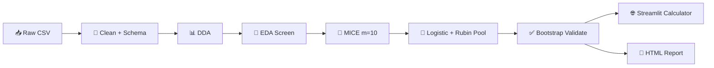

# 🧠 meningioma-atypier

> MRI-based research pipeline for meningioma atypia — from messy clinical spreadsheets to pooled logistic models and a clinician-facing risk calculator.

---

## 🎯 What this project does

**Primary outcome:** estimate the probability of **high-grade meningioma** (WHO grade 2–3) from pre-operative MRI and clinical variables.

The workflow is deliberately **statistics-first, not black-box ML**:

1. 🧹 Clean and type clinical data with an explicit schema
2. 🔍 Screen univariate associations (EDA + diagnostic accuracy)
3. 🧩 Impute missing values with MICE, then pool uncertainty with Rubin's rules
4. 📐 Fit multivariable logistic regression with collinearity control (VIF)
5. ✅ Validate internally (bootstrap optimism correction + shrinkage)
6. 🌐 Ship a **Streamlit calculator** driven by a portable JSON model artifact
7. 📄 Generate a self-contained **HTML report** with figures and interpretation

> ⚠️ **Research tool, not a standalone clinical decision system.** External validation on an independent cohort is required before any clinical use.

---

## 🧬 Dataset

~**400 meningioma cases** (PSKUS cohort export), including:

| Domain | Examples |
|--------|----------|
| 🩻 MRI morphology | tumor volume, margin, dural tail, DWI/T2/T1 signal, ADC |
| 🧪 Histopathology | WHO grade, Ki-67, progesterone receptor, necrosis |
| 🧠 Invasion patterns | brain invasion, sinus invasion, cortical destruction |
| 📏 Size & location | max diameter, skull-base vs non-skull-base, laterality |
| 👤 Demographics | age, sex, multiple meningiomas |

Raw file: `heavy_machinery/Meningiomas PSKUS grants - Visi pacienti.csv`

---

## 🗂️ Repository layout

```
meningioma-atypier/
├── app.py                          # 🌐 Streamlit calculator entry point
├── model_artifacts/
│   └── high_grade_model.json       # 📦 Deployed logistic model + validation stats
├── heavy_machinery/
│   ├── meningioma.ipynb            # 📓 Main pipeline notebook (run top → bottom)
│   ├── cleaning.py                 # 🧹 Schema application, derivations, export
│   ├── schema_infer.py             # 🔎 Auto-detect column types + overrides
│   ├── dda.py                      # 📊 Data discovery & distribution plots
│   ├── eda.py                      # 🔗 Univariate association screening
│   ├── diagnostic_accuracy.py      # 🎯 2×2 diagnostic metrics (sensitivity, PPV…)
│   ├── missingness_resolution.py   # 🧩 MICE multiple imputation
│   ├── inferential.py              # 📐 Rubin-pooled multivariable logistic regression
│   ├── model_validation.py         # ✅ Bootstrap internal validation + shrinkage
│   ├── model_calculator.py         # 🧮 JSON artifact → Streamlit UI
│   ├── atypier_calculator.py       # 🧮 CSV/meta-based probability engine
│   ├── report.py                   # 📄 HTML report builder
│   ├── config/                     # ⚙️ Cohort, rename map, missingness policy, analysis
│   └── output/                     # 📁 Generated tables, figures, report
└── pytests_atypier/                # 🧪 ~180 automated tests
```

---

## 🛠️ Pipeline at a glance



| Stage | Module | What it produces |
|-------|--------|------------------|
| 01–06 | `config/` + `cleaning.py` | Typed cohort, cleaning log, derived columns |
| 07 | `dda.py` | Per-column distribution stats + SVG histograms |
| 08 | `missingness_resolution.py` | Missingness heatmap, MICE imputed frames |
| 09–10 | `eda.py` | Association table + per-pair plots (FDR-corrected) |
| 09b | `diagnostic_accuracy.py` | Sensitivity / specificity / PPV / NPV per feature |
| 11–12 | `inferential.py` | Adjusted ORs, VIF table, forest plot |
| 12b | `model_validation.py` | Optimism-corrected AUC, Brier, calibration slope |
| 13 | `report.py` | `output/report/report.html` |
| 🌐 | `app.py` | Interactive risk calculator |

---

## 📐 Statistical methods (short & honest)

Each choice exists because clinical data is **small-N, missing, and multi-tested** — not because it sounds impressive.

### 🔗 Univariate screening (`eda.py`)

| Comparison | Test | Why |
|------------|------|-----|
| Continuous vs binary outcome | **Mann–Whitney U** | Non-parametric; robust to skewed tumor volumes and ADC values. Effect: rank-biserial *r* = 1 − 2U/(n₁·n₀). |
| Ordinal vs binary | **Spearman ρ** | Uses rank order without assuming equal spacing between WHO-style categories. |
| Nominal vs binary | **χ²** (or **Fisher exact** if sparse) | Tests independence in the 2×K table. Effect: **Cramér's V** = √(χ² / n·min(r−1, c−1)). |
| Multiple predictors per target | **Benjamini–Hochberg FDR** | Controls false discoveries across dozens of MRI features: qᵢ = min_{k≥i} p₍ₖ₎·m/k. |

### 🎯 Diagnostic accuracy (`diagnostic_accuracy.py`)

For each binary MRI sign vs binary outcome, a standard 2×2 table:

- **Sensitivity** = TP / (TP + FN) — catches true high-grade cases
- **Specificity** = TN / (TN + FP) — avoids false alarms
- **PPV / NPV** — what a positive or negative sign actually means in *this* cohort
- **AUC** = (sensitivity + specificity) / 2 — a quick univariate discrimination summary (not ROC-AUC)

### 🧩 Missing data (`missingness_resolution.py`)

- **MICE** (m = 10 imputations): chained equations fill missing values while preserving relationships between variables.
- **Why multiple imputations?** Single imputation treats imputed values as known → **standard errors are too small**. Rubin pooling fixes that.
- **Why m = 10?** At typical clinical missingness (~30%), m = 10 captures ~97% of the information efficiency.

### 📐 Multivariable model (`inferential.py`)

**Design matrix:**
- Continuous / count → **z-score**: z = (x − μ) / σ → OR is "per 1 SD increase"
- Ordinal → numeric codes (preserves order)
- Nominal → one-hot (drop-first reference)
- Binary → 0/1

**Collinearity:** iteratively drop predictors with **VIF > 5**, where VIFⱼ = 1 / (1 − R²ⱼ). Above 5 means the model cannot reliably separate overlapping MRI signs.

**Logistic regression:**

$$P(Y{=}1) = \frac{1}{1 + e^{-(\beta_0 + \sum \beta_j x_j)}}$$

**Adjusted odds ratio:** ORⱼ = e^βⱼ — the multiplicative change in odds per encoded unit of predictor j, holding others constant.

### 🔀 Rubin pooling across imputations

For each coefficient across m = 10 imputed fits:

- Pooled estimate: θ̄ = mean(θᵢ)
- Total variance: T = W + (1 + 1/m)·B
  - W = mean of within-imputation SE² (model uncertainty)
  - B = variance across imputations (missing-data uncertainty)
- Pooled SE = √T; p-values use **Barnard–Rubin** degrees of freedom (small-sample correction when m is modest)

### ✅ Internal validation (`model_validation.py`)

- **Bootstrap optimism correction** (1000 resamples): corrected metric = apparent − mean(optimism)
- **AUC** — discrimination (ranking high-grade vs low-grade)
- **Brier score** — probability accuracy (lower is better; compared to prevalence-only baseline)
- **Calibration slope** — regression of outcome on logit(predicted p); slope ≈ 1 means predicted probabilities match observed rates
- **Shrinkage + intercept recalibration** — coefficients are uniformly shrunk by the optimism-corrected calibration slope; intercept is reset so mean predicted risk matches cohort prevalence

---

## ⚡ Quick start

### 1️⃣ Install

```bash
cd meningioma-atypier
pip install -r requirements.txt
```

### 2️⃣ Run the full pipeline (notebook)

```bash
cd heavy_machinery
jupyter notebook meningioma.ipynb
```

Run all cells top to bottom. Outputs land in `heavy_machinery/output/`.

### 3️⃣ Launch the calculator

```bash
streamlit run app.py
```

The app reads `model_artifacts/high_grade_model.json` — coefficients, feature encodings, and bootstrap validation metrics travel together in one file.

### 4️⃣ Run tests

```bash
python -m pytest
```

---

## 📦 Key outputs

| Path | Contents |
|------|----------|
| `output/eda/tables/associations.csv` | Univariate tests + FDR q-values |
| `output/eda/tables/diagnostic_accuracy.csv` | Sensitivity, specificity, PPV, NPV |
| `output/inferential/tables/high_grade__multivariable.csv` | Adjusted ORs with 95% CI |
| `output/inferential/figures/high_grade__forest.svg` | Forest plot (log-scale OR axis) |
| `output/report/report.html` | Full narrative report with embedded figures |
| `model_artifacts/high_grade_model.json` | Streamlit-ready shrunken model |

---

## 🧠 Tech stack

| Layer | Tools |
|-------|-------|
| Data | pandas, numpy, openpyxl |
| Statistics | scipy, statsmodels |
| Imputation & metrics | scikit-learn |
| Visualization | matplotlib, seaborn |
| Deployment | Streamlit |
| Quality | pytest |

---

## 🧭 Philosophy

- **Clean data before clever models** — schema, missingness policy, and audit logs are first-class outputs, not afterthoughts.
- **Interpretability over complexity** — pooled logistic regression with explicit ORs beats opaque ensembles for a manuscript and for clinicians.
- **Honest uncertainty** — MICE + Rubin pooling + bootstrap correction acknowledge that N is modest and data is incomplete.
- **Reproducible artifacts** — the JSON model file decouples statistical fitting from the Streamlit UI.

---

## 🔮 Status

🟢 **Active research pipeline** — cleaning through validation, report, and calculator are implemented and tested.

Current deployed model (`high_grade_model.json`): **age group + sex** predictors, n = 353, 106 events, optimism-corrected AUC ≈ 0.61. The notebook can refit with the full MRI predictor set as the cohort and imputation strategy evolve.

---

## 📚 Reference style

Univariate diagnostic screening follows the spirit of radiology association tables (e.g. Upreti et al., *Neuroradiology* 2024). Multivariable methods follow standard biostatistics practice: Rubin (1987) pooling, Barnard–Rubin (1999) df, VIF threshold 5 for modest sample sizes.

---

## 📖 Formula guide — DDA, EDA, MICE, inferential

Plain-language notes on **what each number means**, **how it is computed**, and **why this pipeline picked it** over the usual alternatives. No deep theory — just enough to read the output tables with confidence.

---

### 📊 DDA — Descriptive Data Analysis (`dda.py`)

**Purpose:** understand each column *before* any testing or modelling. No p-values here — only "what does the data actually look like?"

| Formula | How it works (brief) | Why here (vs alternatives) |
|---------|----------------------|----------------------------|
| **Missing %** = missing ÷ n × 100 | Share of empty cells per column. | Flags which MRI fields are unusable as-is. **Alternative:** ignore missing until modelling crashes — loses time and hides structural gaps (e.g. ADC only measured when DWI was done). |
| **Median, IQR** (Q3 − Q1) | Middle value; box spans the central 50%. | Tumor volume and edema are often **right-skewed** — one giant meningioma should not define "typical." **Alternative:** mean ± SD assumes symmetry; misleading here. |
| **Mean, trimmed mean** (10% tails cut) | Average; trimmed version drops extreme 5% from each end. | Mean is still useful for reporting; trimmed mean is a **robust** check that outliers are not driving the average. **Alternative:** winsorizing — similar idea, trimming is simpler to explain in a paper. |
| **Std, CV** = std ÷ mean | Spread; CV compares spread relative to size. | CV lets you compare variability across variables on different scales (mm vs cm³). **Alternative:** raw std alone — hard to compare ADC (≈1) with volume (≈100). |
| **Skewness, kurtosis** | Skew = tail heaviness on one side; kurtosis = tail weight vs normal (0 = normal-like). | Early warning for "this needs a non-parametric test later." **Alternative:** eyeballing histograms only — easy to miss in 40+ columns; numbers scale better. |
| **Mode %, class imbalance** = top count ÷ rarest count | How dominant the most common category is. | Catches degenerate fields (e.g. 98% "absent") before χ² tests fail. **Alternative:** plotting only — tables catch imbalance across the whole schema at once. |
| **Entropy** H = −Σ p·log₂(p); **balance** = H ÷ log₂(k) | H measures category diversity; balance scales it 0 (one class) → 1 (even split). | Quantifies whether a nominal field carries information or is nearly constant. **Alternative:** counting levels manually — entropy summarizes imbalance in one number. |
| **Histogram + KDE, boxplot** | Bar counts per bin; smooth curve over the shape; box shows median and outliers. | Visual sanity check alongside the table — spots bimodality, typos, impossible values. **Alternative:** summary stats alone — miss two-peaked ADC distributions or data-entry spikes. |

---

### 🔗 EDA — Exploratory Association Screening (`eda.py`)

**Purpose:** for each target × predictor pair, ask "is there *any* signal worth a closer look?" Tests are **univariate** (one predictor at a time) and p-values are **FDR-corrected per target**.

| Formula | How it works (brief) | Why here (vs alternatives) |
|---------|----------------------|----------------------------|
| **Mann–Whitney U**; effect **r** = 1 − 2U/(n₁·n₀) | Ranks all values, compares ranks between outcome groups. *r* ≈ 0 means no separation, \|r\| near 1 means strong separation. | Continuous MRI measures vs binary outcome (e.g. high-grade yes/no) are **skewed and modest-N**. **Alternative:** two-sample *t*-test assumes normality and equal variance — brittle on tumor volumes. |
| **Spearman ρ** | Correlation on **ranks**, not raw values. ρ ∈ [−1, 1]. | Ordinal predictors (age bins, Ki-67 groups) are ordered but not evenly spaced. **Alternative:** Pearson *r* assumes linearity and equal spacing — wrong for ordered categories. |
| **χ² test**; **Cramér's V** = √(χ² / n·min(r−1,c−1)) | Compares observed vs expected counts in a cross-tab; V scales association 0 → 1. | Nominal MRI signs vs binary outcome — standard "are these patterns linked?" test. **Alternative:** ignoring sparse cells — χ² breaks when expected counts < 5. |
| **Fisher exact** (2×2, sparse cells) | Exact probability for the table — no large-sample approximation. | Used automatically when counts are tiny (rare imaging signs). **Alternative:** forcing χ² on sparse data — inflated false positives. |
| **Kruskal–Wallis**; **ε²** = (H − k + 1)/(n − 1) | Non-parametric "are group medians different?" across 3+ groups. ε² is a simple effect size. | Continuous predictor vs multi-level outcome, or grouped comparisons. **Alternative:** one-way ANOVA — same normality problem as the *t*-test. |
| **Benjamini–Hochberg FDR** qᵢ = min_{k≥i} p₍ₖ₎·m/k | Adjusts p-values so ~5% of "significant" calls are expected false discoveries, not 5% of all tests. | Dozens of MRI features × several targets — uncorrected testing would flood false positives. **Alternative:** Bonferroni (divide α by m) — far too strict, kills real signals in exploratory radiology screens. |

---

### 🧩 MICE — Multiple Imputation (`missingness_resolution.py`)

**Purpose:** fill missing MRI/clinical values **without pretending we know the true value exactly**, then carry that uncertainty into the regression.

| Formula / step | How it works (brief) | Why here (vs alternatives) |
|----------------|----------------------|----------------------------|
| **Missingness heatmap** (co-missing %) | Shows which columns tend to go missing together. | Reveals structural patterns (e.g. ADC missing when DWI wasn't done) — informs the missingness policy. **Alternative:** column-wise % only — miss correlated gaps. |
| **MICE** (m = 10 datasets) | Each missing value is predicted from the other columns, round by round, until stable. Repeat with 10 different random seeds → 10 full datasets. | Preserves relationships between variables (tumor size ↔ edema, location ↔ skull-base signs). **Alternative:** fill everything with the column median — fast, but destroys correlations and makes downstream models overconfident. |
| **Iterative imputer + random forest** | Inner engine: a small random forest predicts each column from the rest, iteratively updating all missing cells. | Handles **mixed types** (numeric + categorical) in one pass. **Alternative:** linear regression imputation — assumes linearity; poor for binary signs and skewed volumes. |
| **Categorical encode → impute → decode** | Nominal/ordinal levels become integer codes for imputation, then mapped back to labels. | Keeps "skull base" as a category, not a meaningless number. **Alternative:** imputing raw strings — most algorithms cannot; imputing as free numeric codes — invents nonsense levels. |
| **Binary left NaN in screening** (`simple_impute`) | Fast single-fill for EDA only: median/mode; binaries stay missing unless explicitly allowed. | "Unknown" ≠ "absent" for imaging signs. **Alternative:** imputing binary as 0 — treats "not recorded" as "definitely negative," which biases association screens. |
| **Why m = 10?** | Rubin: efficiency ≈ (1 + fmi/m)⁻¹. At ~30% missing info, m = 10 recovers ~97% of full efficiency. | Enough copies for stable pooled SEs without 10× runtime cost. **Alternative:** m = 1 (single imputation) — SEs too narrow, invalid inference; m = 50 — diminishing returns for this cohort size. |

---

### 📐 Inferential — Multivariable Logistic Regression (`inferential.py`)

**Purpose:** estimate **adjusted** odds ratios — "if we hold all other MRI signs constant, what does this one contribute to high-grade risk?" Results are **Rubin-pooled** across the 10 imputed datasets.

| Formula | How it works (brief) | Why here (vs alternatives) |
|---------|----------------------|----------------------------|
| **Z-score** z = (x − μ) / σ | Rescales continuous variables to "how many SDs above cohort average." | OR becomes "per 1 SD increase" — comparable across tumor volume, ADC, and diameter. **Alternative:** raw units — OR for volume (per cm³) vs ADC (per 10⁻³ mm²/s) are not comparable on a forest plot. |
| **One-hot encoding** (drop-first) | Each nominal level becomes 0/1 vs a reference category. | Location and margin are categories, not numbers. **Alternative:** integer coding (1,2,3…) — implies equal spacing between "skull base" and "convexity," which is wrong. |
| **VIF** = 1 / (1 − R²ⱼ); drop if > 5 | Measures how much predictor j overlaps with the others. High VIF → unstable coefficients. | MRI signs cluster (e.g. necrosis + heterogeneous enhancement). **Alternative:** keep all collinear terms — huge CIs and uninterpretable ORs; **LASSO** — drops variables but hides *why* they left. |
| **Logistic model** P = 1 / (1 + e^(−linear sum)) | Linear combination of predictors squeezed into a 0–1 probability. | Standard for binary outcomes in clinical research — ORs are directly publishable. **Alternative:** random forest / XGBoost — may score better but offers no transparent adjusted OR for the manuscript or calculator. |
| **Adjusted OR** = e^β | Multiplicative change in odds per unit of encoded predictor, others held fixed. | Clinicians think in "odds of high-grade if sign present vs absent." **Alternative:** reporting only raw coefficients — not intuitive at the bedside. |
| **Rubin pooling** θ̄ = mean(θᵢ); T = W + (1 + 1/m)·B | Average coefficient across 10 imputations; total variance = within-model noise + between-imputation noise. | Only statistically valid way to merge MI results. **Alternative:** fit on one imputed set — ignores imputation uncertainty; **complete-case** — throws away ~30% of patients and can bias if missing is not random. |
| **Barnard–Rubin df** | Small-sample correction for p-values and CIs when m is modest (here m = 10). | Original Rubin df → ∞ too easily when between-variance is small. **Alternative:** normal z-test after MI — anti-conservative with small m. |
| **Forest plot (log-scale OR)** | OR = 1 is null; CI crossing 1 means "not clearly different." Log axis keeps symmetric CIs readable. | Standard visual for multivariable clinical papers. **Alternative:** linear OR axis — squashes large ORs and stretches small ones, harder to read. |
| **EPV check** (events per variable) | Events ÷ number of predictors in the final model. | With ~100 high-grade cases and many MRI features, overfitting is a real risk. **Alternative:** throwing in 30 predictors — apparent fit, nonsense coefficients; **Firth penalized logistic** — viable for tiny EPV but harder to defend than principled VIF pruning + fewer terms. |
