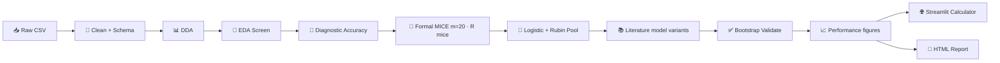

# 🧠 meningioma-atypier

> MRI-based research pipeline for meningioma atypia — from messy clinical spreadsheets to pooled logistic models, literature-aligned multivariable comparisons, and a clinician-facing risk calculator.

---

## 🎯 What this project does

**Primary outcome:** estimate the probability of **high-grade meningioma** (WHO grade 2–3) from pre-operative MRI and clinical variables.

The workflow is deliberately **statistics-first, not black-box ML**:

1. 🧹 Clean and type clinical data with an explicit schema (row filters, derivations)
2. 🔍 Screen univariate associations (EDA + paper-style diagnostic accuracy)
3. 🧩 Impute missing values with formal mixed-type MICE (R `mice`), then pool uncertainty with Rubin's rules
4. 📐 Fit **one or more** multivariable logistic models — your experimental predictor set plus published predictor sets from the literature
5. ✅ Validate internally (bootstrap optimism correction + shrinkage) per model variant
6. 🌐 Ship a **Streamlit calculator** driven by portable JSON model artifacts
7. 📄 Generate a self-contained **HTML report** with a top-of-report provenance dashboard, collapsible sections, and a plain-language explanation beside every figure

> ⚠️ **Research tool, not a standalone clinical decision system.** External validation on an independent cohort is required before any clinical use.

---

## 🧬 Dataset

~**400 meningioma cases** (PSKUS cohort export), including:

| Domain | Examples |
|--------|----------|
| 🩻 MRI morphology | tumor volume, margin, dural tail, DWI/T2/T1 signal, ADC |
| 🧪 Histopathology | WHO grade, Ki-67, progesterone receptor, necrosis |
| 🧠 Invasion patterns | brain invasion, sinus invasion, cortical destruction |
| 📏 Size & location | max diameter, skull-base vs non-skull-base, laterality |
| 👤 Demographics | age, sex, multiple meningiomas |

Default raw file: `Meningiomas PSKUS grants - Visi pacienti.csv`, at the repo root. `load("cohort").load_raw(DATA_PATHS)` accepts a **list** of CSV/XLSX paths and stacks them with `pd.concat`. Optional `ANALYSIS_YEARS` (in the cleaning notebook year-filter cell) subsets by entry year via `apply_cohort_year_filter` (`None` = all years).

---

## 🗂️ Repository layout

```
meningioma-atypier/
├── app.py                          # 🌐 Streamlit calculator entry point
├── meningioma-cleaning.ipynb       # 🧹 Cohort cleaning → output/datasets/ (run first)
├── meningioma-modelling.ipynb      # 🧠 EDA + multivariable + report (run second)
├── meningioma-cutpoints.ipynb      # 🎯 Cut-points, step by step → manuscript tables (run third)
├── meningioma-manuscript.ipynb     # 📄 AJNR exports; its outputs ARE the artifact, so they stay committed
├── .gitattributes                  # 🧼 nbstripout filter — install it once per clone (see Quick start)
├── pytest.ini                      # 🧪 Test discovery (repo root)
├── pyrightconfig.json              # 🔍 basedpyright extraPaths for phase imports
├── requirements.txt                # 📦 Python dependencies
├── output/                         # 📁 Generated tables, figures, report (gitignored)
│   ├── datasets/                   # Parquet handoff between notebooks
│   ├── dda/
│   │   ├── figures/                # Univariate DDA PNGs (pruned once embedded)
│   │   ├── figures_bivariate/      # Optional bivariate DDA PNGs
│   │   └── figures_trivariate/     # Optional trivariate DDA PNGs
│   ├── eda/
│   │   ├── tables/                 # associations.csv, diagnostic_accuracy.csv
│   │   └── figures/                # per-pair plots + association_heatmap.png
│   ├── inferential/
│   │   ├── tables/                 # Multivariable CSV + *__calculator.json
│   │   ├── figures/                # Forest, ROC, calibration, decision curve,
│   │   │                           #   model comparison, performance overview
│   │   └── model_artifacts/        # Streamlit JSON per model variant
│   ├── panel/                      # 🔬 §04.5 marker panel — tables + count-score figure
│   ├── cutpoints/                  # 🎯 Cut-point phase — read by nothing else
│   │   ├── figures/                # fig_1_cutpoints, fig_2_decision (TIFF kept, PNG pruned)
│   │   ├── tables/                 # table_1.docx, supplemental_tables.docx (S1–S4)
│   │   ├── cutpoint_report.html    # Proof sheet: dashboard, every table, both figures
│   │   └── manifest.json           # Commit, library versions, seeds, hash of every file
│   └── report/report.html
└── heavy_machinery/                # 📚 Pipeline library code
    ├── cleaning_phase/             # 🧹 Schema, cleaning, DDA, MICE, handoff, validation
    │   ├── cleaning.py
    │   ├── schema_infer.py
    │   ├── dda.py
    │   ├── missingness_resolution.py
    │   ├── validation.py
    │   └── dataset_handoff.py
    ├── modelling_phase/            # 🧠 EDA, inferential, validation, report, calculator
    │   ├── eda.py
    │   ├── eda_paper_tables.py     # Paper-style univariate tables (native / derived × datatype)
    │   ├── diagnostic_accuracy.py
    │   ├── delong.py               # 📏 The one place a score becomes an AUC and its interval
    │   ├── inferential.py
    │   ├── model_validation.py
    │   ├── model_calculator.py
    │   ├── model_comparison.py     # Combined model vs each single predictor it is built from
    │   ├── variable_selection.py   # Top-k predictors by discrimination, written down and auditable
    │   ├── marker_panel.py         # 🔬 §04.5 marker panel — the two study aims
    │   ├── marker_rules.py         # Metric, ROC table, five cut-point selection rules
    │   ├── combinations.py         # AND / OR / count rules + benchmarks
    │   ├── rule_matrix.py          # ⚡ The same rule menu as boolean arrays — for the bootstrap
    │   ├── scales.py               # 📏 Which columns are log1p — one source of truth
    │   ├── performance_plots.py    # 📈 ROC / calibration / decision curve / comparison / overview
    │   ├── plot_style.py           # 🎨 One shared figure toolkit for the whole pipeline
    │   └── report.py
    ├── cutpoint_phase/             # 🎯 One question per module, in notebook order
    │   ├── loading.py · measurements.py · separation.py       # steps 1–3
    │   ├── nonlinearity.py · bend_location.py · eligibility.py  # steps 4–5
    │   ├── criteria.py · wobble.py · imputation.py            # steps 6–8
    │   ├── dichotomy.py · ranking.py · collinearity.py · models.py  # steps 9–11
    │   ├── scorecard.py · segmented.py · decision_curve.py    # steps 12–14
    │   ├── accuracy.py · intervals.py   # Sens/spec per cut-point · Wilson intervals, never Wald
    │   ├── ajnr_style.py · ajnr_format.py · figures.py        # what the journal sees
    │   ├── docx_tables.py · manuscript_tables.py · report_html.py
    │   └── outputs.py · manifest.py # step 15: writes files, computes nothing
    ├── config/                     # ⚙️ Pipeline config · `load("name")` (no numeric prefixes)
    │   ├── cohort.py               # load_raw + ANALYSIS_YEARS filter
    │   ├── column_rename_map.py
    │   ├── schema_overrides.py
    │   ├── row_filters.py
    │   ├── missingness.py
    │   ├── derivations.py
    │   ├── analysis.py             # EDA / literature / experimental variants
    │   ├── published_models.py     # Odds ratios transcribed from source papers — reference only
    │   └── report_settings.py
    ├── scripts/run_mice.R          # 🧬 R mice engine (subprocess from Python)
    ├── pytests_atypier/            # 🧪 664 automated tests
    └── pytest.ini                  # Optional: `cd heavy_machinery && python -m pytest`
```

### 📦 Import paths

Run notebooks and commands from the **repo root** (`meningioma-atypier/`, same folder as `app.py`).

| Context | How imports work |
|---------|------------------|
| **Notebooks** | `from heavy_machinery.config import load` and `from heavy_machinery.cleaning_phase…` / `heavy_machinery.modelling_phase…` |
| **Library modules** | Flat sibling imports (`from schema_infer import ColSpec`, `from plot_style import …`) — `heavy_machinery.config` prepends `cleaning_phase/`, `modelling_phase/` and `cutpoint_phase/` to `sys.path` |
| **pytest** | Root `pytest.ini` → `heavy_machinery/pytests_atypier/` with the same `pythonpath` as above |
| **Type checking** | `pyrightconfig.json` adds phase folders + test package to `extraPaths` |

`output/` and all generated artifacts (including `output/inferential/model_artifacts/`) live at the repo root, not under `heavy_machinery/`.

---

## 🛠️ Pipeline at a glance



| Stage | Module | What it produces |
|-------|--------|------------------|
| Cleaning | `heavy_machinery/config/` + `cleaning_phase/cleaning.py` | Typed cohort, cleaning log (`n_rows` / `n_columns`), derived columns; `schema_coercion.csv` audits value→value changes (incl. → missing) |
| DDA | `cleaning_phase/dda.py` | Per-column distribution stats + one PNG per column; optional **bivariate** (`run_dda_bivariate` → `output/dda/figures_bivariate/`); optional **trivariate** (`run_dda_trivariate` → `output/dda/figures_trivariate/`). Descriptive only — percentages carry their counts and confidence intervals, and no p-values appear |
| Missingness / MICE | `cleaning_phase/missingness_resolution.py` | Missingness bars + co-missingness heatmap, formal MICE imputed frames + diagnostics |
| EDA | `modelling_phase/eda.py` | Association table + per-pair plots (FDR-corrected) + **association-strength heatmap** (`association_heatmap.png`) |
| Diagnostic accuracy | `modelling_phase/diagnostic_accuracy.py` | Sensitivity / specificity / PPV / NPV / Wilson CIs per feature |
| Inferential | `modelling_phase/inferential.py` | Adjusted ORs, VIF, forest plot (log OR, coloured by direction), Streamlit JSON — **one block per model variant** |
| Performance figures | `modelling_phase/performance_plots.py` | ROC, calibration, and decision curve per variant, plus two across-model figures: **model comparison** (AUC, Brier, calibration slope) and **model performance overview** (corrected vs apparent AUC, and the gain over a single predictor) |
| Plotting | `modelling_phase/plot_style.py` | **One figure toolkit** for the whole pipeline: SciencePlots `science`+`nature`+`no-latex` overridden to Arial/Helvetica (radiology house font), colour-blind-safe palette, print-column sizing, confidence intervals for percentages, reproducible point scatter, and clinician-readable labels for every axis and category |
| Validation | `modelling_phase/model_validation.py` | Optimism-corrected AUC, Brier, calibration slope, plus the calibration and decision-curve data behind the figures → merged into calculator JSON |
| Report | `modelling_phase/report.py` | `output/report/report.html` (collapsible sections) |
| 🌐 | `app.py` | Interactive risk calculator — default `*_experimental_model_1_model.json` |

### 📓 What belongs in a notebook cell

The notebooks are the control panel, not the machine room. A Python code cell holds only three kinds of line:

1. **Inputs you choose** — column lists, target lists, `MARKERS_TO_EXCLUDE`, `REPORT_TITLE`. Anything a different study would set differently.
2. **Function calls** into `heavy_machinery/`.
3. **Comments** — explanations, and commented-out alternatives kept as a scratchpad.

No `def`, no `if`/`else`, no loops, no comprehensions. If a cell needs one, the logic belongs in a module, where it can be tested and where a reviewer will actually see it. This is not tidiness for its own sake: a `def` inside a cell is a function no test ever runs, and the `panel_key` bug lived in exactly such a cell for months — it stripped `_model` wherever it appeared instead of only at the end, and worked only because both sides of the comparison were mangled identically. Moving it into `marker_panel.py` is what exposed it.

### 📚 Multiple multivariable models

In `meningioma-modelling.ipynb` (§01, the cells under *Load handoff*), configure three separate lists:

| Cell | Variable | Purpose |
|------|----------|---------|
| EDA | `EDA_TARGETS`, `EDA_PREDICTORS` | Wide univariate screening pool |
| Literature | `LITERATURE_MODEL_VARIANTS` | Published predictor sets to replicate |
| Experimental | `EXPERIMENTAL_MODEL_VARIANTS` | Your own models (any count; each with its own target + predictors) |

Each variant is `(id, title, link, target, [predictors])` or an equivalent dict. Put custom models in `EXPERIMENTAL_MODEL_VARIANTS` — the report groups by list, not by id prefix.

A resolve cell merges literature + experimental lists, filters to columns present in `df`, and derives `INFERENTIAL_TARGETS`. Run `load("analysis").print_copy_pasteable_columns(df)` in §01 to copy column names into your lists.

Each variant gets its own:

- EPV stability gauge (threshold marker at **EPV = 10**; events = **minority** class count ÷ design columns)
- Rubin-pooled coefficient table + forest plot
- VIF diagnostics (collapsed by default)
- Per-variant `*__calculator.json` → `output/inferential/model_artifacts/<target>_<id>_model.json`

Re-running §04 **clears stale per-variant inferential files** (tables, forest plots, and Streamlit JSON) before writing new ones — renamed or removed models no longer appear in the report or calculator.

The built-in literature example is the published meningioma grading model of Radeesri & Lekhavat 2023 (Asian Pacific J Cancer Prev 24(3):819–825), reproduced with its three retained MRI features.

---

## 📐 Statistical methods

Each choice exists because clinical data is **small-N, missing, and multi-tested** — not
because it sounds impressive. Each table says what the number is, how it is computed, and
what it was picked over. The HTML report embeds shorter versions beside each section.

---

### 📊 DDA — Descriptive Data Analysis (`cleaning_phase/dda.py`)

**Purpose:** understand each column *before* any testing or modelling. No p-values here — only "what does the data actually look like?"

| Formula | How it works (brief) | Why here (vs alternatives) |
|---------|----------------------|----------------------------|
| **Missing %** = missing ÷ n × 100 | Share of empty cells per column. | Flags which MRI fields are unusable as-is. **Alternative:** ignore missing until modelling crashes — loses time and hides structural gaps (e.g. ADC only measured when DWI was done). |
| **Median, IQR** (Q3 − Q1) | Middle value; box spans the central 50%. | Tumor volume and edema are often **right-skewed** — one giant meningioma should not define "typical." **Alternative:** mean ± SD assumes symmetry; misleading here. |
| **Mean, trimmed mean** (10% tails cut) | Average; trimmed version drops extreme 5% from each end. | Mean is still useful for reporting; trimmed mean is a **robust** check that outliers are not driving the average. **Alternative:** winsorizing — similar idea, trimming is simpler to explain in a paper. |
| **Std, CV** = std ÷ mean | Spread; CV compares spread relative to size. | CV lets you compare variability across variables on different scales (mm vs cm³). **Alternative:** raw std alone — hard to compare ADC (≈1) with volume (≈100). |
| **Skewness, kurtosis** | Skew = tail heaviness on one side; kurtosis = tail weight vs normal (0 = normal-like). | Early warning for "this needs a non-parametric test later." **Alternative:** eyeballing histograms only — easy to miss in 40+ columns; numbers scale better. |
| **Mode %, class imbalance** = top count ÷ rarest count | How dominant the most common category is. | Catches degenerate fields (e.g. 98% "absent") before χ² tests fail. **Alternative:** plotting only — tables catch imbalance across the whole schema at once. |
| **Entropy** H = −Σ p·log₂(p); **balance** = H ÷ log₂(k) | H measures category diversity; balance scales it 0 (one class) → 1 (even split). | Quantifies whether a nominal field carries information or is nearly constant. **Alternative:** counting levels manually — entropy summarizes imbalance in one number. |
| **Distribution figure** (numeric columns) | One panel: histogram of counts, a smooth curve over it, and above it a box plot with every patient shown as a dot. | Shape, typical value, spread, and outliers in one glance — spots bimodality, typos, and impossible values. **Alternative:** a separate histogram and box plot — forces the reader to line up two x-axes by eye. |
| **Percentage bars with intervals** (category columns) | Bar height = share of patients; whisker = 95% confidence interval; label = `41% (93/243)`. | A percentage without its denominator is unreadable: 50% of 4 patients and 50% of 300 look identical otherwise. **Alternative:** plain count or proportion bars — hide both the denominator and the uncertainty. |
| **Timeline** (date columns) | Monthly counts on a real calendar axis, including months with nothing in them. | Recruitment pauses stay visible. **Alternative:** plotting only the months that have data — silently compresses the gaps and invents steady accrual. |
| **Bivariate plots** (`run_dda_bivariate`) | Selected `x` columns paired with partner columns → PNGs under `figures_bivariate/`. Numeric pairs get a scatter with a flexible trend line; a numeric split by group gets side-by-side distributions (density, box, and raw points, each group in its own lane); two categories get percentages within each group with confidence intervals. | Shows how demographics or grade shift distributions **before** formal tests. **Alternative:** overlapping translucent histograms — with unequal group sizes the overlap reads as a third category and the taller group hides the shorter one. |
| **Trivariate plots** (`run_dda_trivariate`) | Two columns compared across a third grouping column → PNGs under `figures_trivariate/`. Numeric pairs get one flexible trend line per group; a numeric split by two categories gets boxes with their raw points beside them; two categories get percentage panels with confidence intervals on a shared 0–100 scale. Ordered categories keep their order. Optional `science_style=` override. | Shows whether relationships differ by grade/sex (and similar) before modelling. **Alternative:** drawing both a straight-line fit and a flexible one per group — triples the legend and invites the reader to pick whichever looks stronger. |

---

---

### 🔗 EDA — Exploratory Association Screening (`modelling_phase/eda.py`)

**Purpose:** for each target × predictor pair, ask "is there *any* signal worth a closer look?" Tests are **univariate** (one predictor at a time) and p-values are **FDR-corrected per target**. Every per-pair figure carries its own test, effect size, and corrected p-value in its legend sidecar, printed as text beside the plot, so the picture and the table can never tell different stories. An optional **association heatmap** puts all pairs on one colour grid; measures that carry a direction keep their sign, while strength-only measures (Cramér's V, ε²) are **hatched** so a strong colour there is never read as "higher risk", and untested pairs are grey rather than near-white.

| Formula | How it works (brief) | Why here (vs alternatives) |
|---------|----------------------|----------------------------|
| **Mann–Whitney U**; effect **r** = 2U₁/(n₁·n₀) − 1 | Ranks all values, compares ranks between outcome groups (always U for outcome==1). *r* > 0 ⇒ positive class tends higher; \|r\| near 1 means strong separation. | Continuous MRI measures vs binary outcome (e.g. high-grade yes/no) are **skewed and modest-N**. **Alternative:** two-sample *t*-test assumes normality and equal variance — brittle on tumor volumes. |
| **Spearman ρ** | Correlation on **ranks**, not raw values. ρ ∈ [−1, 1]. | Ordinal predictors (age bins, Ki-67 groups) are ordered but not evenly spaced. **Alternative:** Pearson *r* assumes linearity and equal spacing — wrong for ordered categories. |
| **χ² test**; **Cramér's V** = √(χ² / n·min(r−1,c−1)) | Compares observed vs expected counts in a cross-tab; V scales association 0 → 1. | Nominal MRI signs vs binary outcome — standard "are these patterns linked?" test. **Alternative:** ignoring sparse cells — χ² breaks when expected counts < 5. |
| **Fisher exact** (2×2, sparse cells) | Exact probability for the table — no large-sample approximation. | Used automatically when counts are tiny (rare imaging signs). **Alternative:** forcing χ² on sparse data — inflated false positives. |
| **Kruskal–Wallis**; **ε²** = (H − k + 1)/(n − 1) | Non-parametric "are group medians different?" across 3+ groups. ε² is a simple effect size. | Continuous predictor vs multi-level outcome, or grouped comparisons. **Alternative:** one-way ANOVA — same normality problem as the *t*-test. |
| **Benjamini–Hochberg FDR** qᵢ = min_{k≥i} p₍ₖ₎·m/k | Adjusts p-values so ~5% of "significant" calls are expected false discoveries, not 5% of all tests. | Dozens of MRI features × several targets — uncorrected testing would flood false positives. **Alternative:** Bonferroni (divide α by m) — far too strict, kills real signals in exploratory radiology screens. |
| **ROC-AUC** (`auc_univariate`) | Rank-based area under the ROC curve for binary predictor vs binary outcome; flipped if < 0.5. | Adds a discrimination column comparable across binary signs. **Alternative:** only p-values — two features with similar p can differ sharply in clinical separation. |

---

---

### 🎯 Diagnostic accuracy (`modelling_phase/diagnostic_accuracy.py`)

**Purpose:** radiology-style 2×2 performance metrics per binary imaging sign — complementary to EDA, not a substitute for multivariable modelling.

| Formula | How it works (brief) | Why here (vs alternatives) |
|---------|----------------------|----------------------------|
| **Sensitivity / specificity** | TP rate and TN rate from a 2×2 table. | Directly maps to "how often does this sign flag high-grade?" **Alternative:** only ORs from EDA — harder to compare with published radiology tables. |
| **Wilson 95% CI** | Binomial CI for proportions; stable at small n. | Cohort sizes per sign are modest; normal approximation CIs can go outside [0, 1]. **Alternative:** Wald interval — unreliable when events are rare. |
| **AUC** = (sens + spec) / 2 | Quick univariate summary used in several meningioma imaging papers. | Matches literature tables for side-by-side comparison. **Alternative:** full ROC-AUC — better statistically, but not what those papers report; EDA already carries ROC-AUC separately. |

PPV and NPV carry Wilson intervals too. The AUC in this table is **not** a ROC-AUC — the
multivariable section reports a real one for fitted models, so the two carry different column
labels wherever they appear.

**Categorical predictors are skipped, not converted.** A nominal column has no single "present" level to score, so it is listed with the note *"Skipped: categorical — add a binary derivation in the cleaning notebook to include it"*. The screen used to invent contrasts of its own (`sex` → `sex_male`), which put rows in this table for columns that existed nowhere else in the pipeline — the marker panel then dropped them silently. A contrast has to be a real derivation, and then every section sees it.

The HTML report renders this as a collapsible **"Like in that research"** table per target, laid out as *Table X.* with its own footnote block: sort rule, cohort prevalence with the PPV/NPV caveat, and every abbreviation spelled out, so the table stands alone if lifted into a manuscript.

---

### 🧩 MICE — Formal Mixed-Type Multiple Imputation (`cleaning_phase/missingness_resolution.py` + `heavy_machinery/scripts/run_mice.R`)

**Purpose:** fill missing MRI/clinical values **without pretending we know the true value exactly**, using a model appropriate to each variable type, then carry that uncertainty into the regression via Rubin pooling.

| Formula / step | How it works (brief) | Why here (vs alternatives) |
|----------------|----------------------|----------------------------|
| **Missingness heatmap** (co-missing %) | Shows which columns tend to go missing together. | Reveals structural patterns (e.g. ADC missing when DWI wasn't done) — informs the missingness policy. **Alternative:** column-wise % only — miss correlated gaps. |
| **Formal MICE** (`proper_mice_impute`, one `mice()` FCS chain) | Temporarily initialises missing cells, then imputes each incomplete variable in turn using the latest values of the others, cycling `maxit` times to produce `m` completed datasets that share the chain. | Preserves relationships **and** between-imputation uncertainty for valid Rubin pooling. **Alternative:** independent single-pass imputers — not true MICE, understate uncertainty. |
| **Type-matched models** | continuous/count → **PMM**, binary → **logreg**, nominal → **polyreg**, ordinal → **polr** (recorded in `methods.csv`). | One model per declared kind; PMM draws real donor values so counts stay integer and continuous stay plausible. **Alternative:** one regression for all types, or numeric-code + round for categoricals — invents impossible categories. |
| **Explicit predictor matrix** | Built in R (`predictor_matrix.csv`): row id, IDs, text, datetime, skipped, derived, and excluded columns are zeroed. | Nothing silently drives the imputations; fully auditable. **Alternative:** let `mice` auto-pick predictors — opaque and can leak IDs/derived leakage. |
| **Derived-column handling** | Non-outcome derived columns (e.g. `age_bins`, `ki67_group`) are dropped before R and **recreated from imputed sources** by the notebook's own derivation function via a `DERIVED_DEPENDENCIES` map. | Avoids contradictions like `meningioma_count=1` with `multiple_meningiomas=True`. **Alternative:** copy clinical thresholds into R — duplicates logic and drifts out of sync. |
| **R engine via `subprocess`** | Python writes `input.csv` + `mice_spec.json`, runs `heavy_machinery/scripts/run_mice.R`, reloads completed datasets, restores dtypes, validates (incl. Pandera) every frame. | Uses the gold-standard `mice` package without `rpy2`; the notebook call is unchanged. **Alternative:** reimplement MICE in Python — error-prone and non-standard. |
| **Cell-variation diagnostic** | `imputed_cell_variation.csv` summarises how each originally-missing cell varies across the `m` draws (mean/sd or level counts). | Honest view of imputation spread. **Alternative:** reporting a single draw — hides uncertainty; **not** a confidence interval. |
| **Binary left NaN in screening** (`simple_impute`) | Fast single-fill for EDA only: median/mode; binaries stay missing unless explicitly allowed. | "Unknown" ≠ "absent" during exploratory screening. **Alternative:** imputing binary as 0 — treats "not recorded" as "definitely negative." |
| **RF chained (sensitivity only)** (`rf_chained_impute`) | Random-forest `IterativeImputer` + post-hoc Bernoulli for binaries, parallel via `joblib`. | Retained as a labelled robustness check. **Alternative (and the old default):** treating it as formal MI — it is **not** (`proper_multiple_imputation=False`, no Rubin pooling). |
| **Why m = 20?** | Rubin: efficiency ≈ (1 + fmi/m)⁻¹. At moderate missing-information fractions, m = 20 recovers nearly full efficiency and stabilises CIs. | Enough copies for stable pooled SEs. **Alternative:** m = 1 — SEs too narrow, invalid inference; m = 3 is for smoke runs only. |

---

- **Post-imputation:** dtypes restored to match the original cohort (`Categorical` levels/order, nullable `Float64`/`Int64`/`boolean`); every frame is validated for row identity, unchanged observed cells, legal categories, derived consistency, and **Pandera** — not just the first draw.
**Beyond the table**, in operation:

- **Diagnostics written every run:** `methods.csv`, `predictor_matrix.csv`, `logged_events.csv`, `chain_diagnostics.png`, `r_session.json`, and `imputed_cell_variation.csv` (how each originally-missing cell varies across draws — a diagnostic, not a CI).
- **Binary imaging signs are now imputed** by logistic regression inside the MICE chain under MAR (conditional on the other predictors), so patients are retained and imputation uncertainty propagates through Rubin pooling. If a sign's missingness is likely informative (MNAR), interpret it with a separate sensitivity analysis.
- **Sensitivity method — RF chained imputation** (`rf_chained_impute`, legacy alias `mice_impute`): random-forest `IterativeImputer` with post-hoc Bernoulli sampling for binary cells, run in parallel via `joblib` with OS-aware CPU/battery limits. Marked `proper_multiple_imputation=False` — **not** valid for Rubin pooling; kept only as a labelled sensitivity analysis.

**Requires R** with the `mice` and `jsonlite` packages (one-time):

```r
install.packages(c("mice", "jsonlite"))
```

**Notebook profiles** (cleaning §11 `proper_mice_impute` cell):

| Profile | `m` | `max_iter` |
|---------|-----|------------|
| Smoke / fast iteration | 3 | 5 |
| Publication | 20 | 20 |

---

### 📐 Inferential — Multivariable Logistic Regression (`modelling_phase/inferential.py`)

**Purpose:** estimate **adjusted** odds ratios — "if we hold all other MRI signs constant, what does this one contribute to high-grade risk?" Results are **Rubin-pooled** across the m formal-MICE datasets. Run multiple **variants** to compare your cohort against published predictor sets.

| Formula | How it works (brief) | Why here (vs alternatives) |
|---------|----------------------|----------------------------|
| **Z-score** z = (x − μ) / σ | Rescales continuous variables to "how many SDs above cohort average." | OR becomes "per 1 SD increase" — comparable across tumor volume, ADC, and diameter. **Alternative:** raw units — OR for volume (per cm³) vs ADC (per 10⁻³ mm²/s) are not comparable on a forest plot. |
| **One-hot encoding** (drop-first) | Each nominal level becomes 0/1 vs a reference category. | Location and margin are categories, not numbers. **Alternative:** integer coding (1,2,3…) — implies equal spacing between "skull base" and "convexity," which is wrong. |
| **VIF** = 1 / (1 − R²ⱼ); drop if > 5 | Measures how much predictor j overlaps with the others. High VIF → unstable coefficients. | MRI signs cluster (e.g. necrosis + heterogeneous enhancement). **Alternative:** keep all collinear terms — huge CIs and uninterpretable ORs; **LASSO** — drops variables but hides *why* they left. |
| **Logistic model** P = 1 / (1 + e^(−linear sum)) | Linear combination of predictors squeezed into a 0–1 probability. | Standard for binary outcomes in clinical research — ORs are directly publishable. **Alternative:** random forest / XGBoost — may score better but offers no transparent adjusted OR for the manuscript or calculator. |
| **Adjusted OR** = e^β | Multiplicative change in odds per unit of encoded predictor, others held fixed. | Clinicians think in "odds of high-grade if sign present vs absent." **Alternative:** reporting only raw coefficients — not intuitive at the bedside. |
| **Rubin pooling** θ̄ = mean(θᵢ); T = W + (1 + 1/m)·B | Average coefficient across the m formal-MICE datasets; total variance = within-model noise + between-imputation noise. | Only statistically valid way to merge MI results. **Alternative:** fit on one imputed set — ignores imputation uncertainty; **complete-case** — throws away ~30% of patients and can bias if missing is not random. |
| **Barnard–Rubin df** | Small-sample correction for p-values and CIs when m is modest (publication profile m = 20). | Original Rubin df → ∞ too easily when between-variance is small. **Alternative:** normal z-test after MI — anti-conservative with small m. |
| **Forest plot (log-scale OR)** | OR = 1 is null; a bar crossing 1 means "not clearly different either way". Colour shows **direction** — one colour raises the odds, another lowers them. Rows sort strongest-first. Rescaled predictors are labelled *per 1 SD* with the actual size of that SD. | Direction is what a clinician reads first, and the bar crossing the line already shows whether the evidence is clear. **Alternative:** colouring by "CI excludes 1" — turns a sliding scale into an on/off light, and disagrees with the multiple-testing correction used during screening. |
| **ROC curve** | Plots how many true cases you catch against how many false alarms you accept, across every possible cut-off. The diagonal is a coin flip. | Answers "can the model sort patients at all?" Both the raw and the corrected score are shown, because the raw one is measured on the same patients the model was built from. **Alternative:** quoting one accuracy figure — hides the trade-off you actually choose in clinic. |
| **Calibration plot** | Patients are grouped into ten risk bands; each band's predicted risk is plotted against what actually happened, with a confidence interval, against the ideal diagonal. | The decisive figure if the model is used as a calculator: **when it says 30%, is it 30%?** A model can rank patients well and still be badly wrong about the numbers. **Alternative:** reporting the calibration slope alone — one number cannot show *where* along the risk range the model drifts. |
| **Decision curve** | For each risk threshold a clinician might act on, plots the net benefit of using the model against treating everyone and treating no one. | Answers the only question that decides adoption: **is this better than the simple alternatives?** The model is worth using only where its line sits above both. **Alternative:** AUC alone — a model can discriminate well and still never beat "scan everyone" at any sensible threshold. |
| **Model comparison figure** | Every variant on the same three scales (discrimination, error, calibration), hollow marker = raw score, filled = corrected. | Puts the published predictor sets and your experimental ones side by side **on your cohort**, and the gap between the two markers shows how much each was overfitting. **Alternative:** reading seven separate forest plots — no way to rank them. |
| **EPV check** (events per variable) | Minority-class events ÷ number of design columns in the final model. | With ~100 high-grade cases and many MRI features, overfitting is a real risk. Report marks **≥ 10 stable**, **5–10 borderline**, **< 5 underpowered**. **Alternative:** throwing in 30 predictors — apparent fit, nonsense coefficients. |
**Design matrix:**
- Continuous / count → **z-score**: z = (x − μ) / σ → OR is "per 1 SD increase"
- Ordinal → numeric codes (preserves order)
- Nominal → one-hot (drop-first reference)
- Binary → 0/1

**The rest of the design matrix:** ordinal → numeric codes, which preserves the order; binary →
0/1.

**Collinearity:** iteratively drop predictors with **VIF > 5**.

**Sample-size guard:** EPV = minority-class events ÷ design columns. Report flags **≥ 10 stable**, **5–10 borderline**, **< 5 underpowered**.

**Rubin pooling** across the m formal-MICE fits with **Barnard–Rubin** degrees of freedom (only manifests marked `proper_multiple_imputation=True` are pooled; RF sensitivity draws are rejected/flagged).

---

### ✅ Internal validation (`modelling_phase/model_validation.py`)

Any model looks better on the patients it was built from than it will on the next patient. Bootstrap validation measures **how much of the performance is real** and how much is flattery.

- **Bootstrap optimism correction** (1000 resamples)
- **AUC**, **Brier score**, **calibration slope** — each reported twice: as it appears on the development cohort, and after the optimism is subtracted
- **Shrinkage + intercept recalibration** → exported into each Streamlit JSON artifact
- Feeds the three performance figures below, so the report shows the corrected numbers rather than only the flattering ones

### 🎯 Cut-points (`cutpoint_phase/`)

An **independent** analysis, driven by `meningioma-cutpoints.ipynb`. It reads the same `output/datasets/` handoff and writes only to `output/cutpoints/`, which nothing else reads. That separation is structural, not stylistic: a cut-point estimated on this cohort has already seen the outcome, so feeding it back into imputation or the multivariable models would leak the answer into the predictors. Published cut-points are the exception and live in cleaning as derived flags.

The notebook is written to be read in order, one question per step, with the statistics explained rather than assumed. The five headline cut-points are **frozen** — ADC ≤ 0.72, max diameter ≥ 3.81 cm, tumour volume ≥ 15.1 cm³, oedema volume ≥ 4.76 cm³, oedema index ≥ 0.0617 — and every step that resamples is allowed to bracket them, never to move them. That is enforced by assertion (`wobble.FrozenCutpointError`), not by convention.

**Is a threshold even real?** (`nonlinearity.py`, `bend_location.py`) — a logistic regression with the measurement entered as a **restricted cubic spline** (Harrell quantile knots, three knots at this sample size), tested against a straight line by likelihood ratio. The test is run twice, in clinical units *and* on `log1p(x)`, because whether a curve looks bent depends on the axis it is drawn against, and a bend that survives only one scale is a claim about the axis. Only ADC bends on both. A steepest-rise point is quotable only when the bend is real and the maximum is interior to the data — otherwise the module reports that risk rises steadily and refuses to name a threshold.

**Where does the break sit?** (`segmented.py`) — a spline has no break, so its "steepest point" cannot carry an interval. **Segmented regression** fits what a threshold claim actually implies, two straight lines meeting at ψ, and estimates ψ as a parameter. Its P value carries **Davies' correction**: under the null ψ has no effect on the model at all, so the ordinary likelihood-ratio test is anti-conservative and finds breakpoints in straight lines. ΔAIC charges for both added parameters (`ΔAIC = 4 − χ²`).

**Which number, and how much does it move?** (`criteria.py`, `wobble.py`, `imputation.py`) — the ROC sweep of every distinguishable cut-point under four optimum-seeking criteria (Youden, closest-to-perfect, sens = spec, index of union) and three pre-specified ones. Each cut-point gets a **percentile bootstrap interval with the cut-point re-derived inside every resample** — evaluating one fixed value across resamples measures the stability of its performance, not of the number — plus an **optimism-corrected Youden J** scored on the patients each resample left out. Everything is then re-derived on each of the *m* = 20 MICE draws. ⚠️ The across-draw spread is **between-imputation variance only, not Rubin pooling**: a cut-point chosen by maximising J has neither a normal sampling distribution nor a within-imputation variance to combine, so it is a stability check and must never be quoted as a confidence interval.

**What does cutting cost?** (`dichotomy.py`, `ranking.py`, `collinearity.py`, `models.py`) — the AUC of the raw number against the AUC of the yes/no flag, compared by **DeLong on the same patients**, with the share of discriminating power retained. Spearman ρ flags pairs that move together; **VIF** then says whether they can share a model. Two pairs here sit at ρ ≈ 0.92, and max diameter's odds ratio moves from 0.90 (P = .73, VIF 6.05) in the five-predictor model to 1.38 (P = .036, VIF 1.43) in the three-predictor one — the same patients, the same measurement, opposite readings.

**Is it worth acting on?** (`decision_curve.py`) — the only step whose answer a clinician can act on. **Net benefit**, `TP/n − (FP/n) × t/(1−t)`, plotted across every threshold probability *t* a reasonable reader might hold, against the two strategies available for free: treat everyone as high grade, treat no one. A rule is worth following only where its line sits above both. Both the cut-point and the same measurement kept continuous are **corrected for optimism in the same 1000 resamples and with the same seed** as the Youden J, so the comparison between "use the number" and "use the yes/no rule" is like for like.

`outputs.py` writes what the journal receives — `table_1.docx`, `supplemental_tables.docx` (S1–S4), two 600-dpi TIFFs — plus `cutpoint_report.html`, a self-contained proof sheet with the dashboard, every table and both figures inlined. It calculates nothing: every number arrives already estimated and already formatted, because a writer that recomputes is a second analysis, free to disagree with the first. The Word files are **audited after writing**, by re-opening the saved file rather than trusting the object in memory — borders live in the style definition rather than in the table XML, and widths are stored in twips and rounded up, so both were silently wrong until the audit read them back off disk.

`manifest.py` records what produced the run: commit and whether the tree was dirty, Python and library versions, every seed and resample count imported from the module that owns it, a SHA-256 of the cohort file, and a hash of every file written. `mf.verify(path)` re-reads them later and names anything that has changed since.

---

## 📊 What the figures tell you

Every figure is a PNG for the report plus a 600–1200 dpi TIFF under `ATYPIER_FIGURES=submission`,
drawn through one shared toolkit (`modelling_phase/plot_style.py`).

The words that explain a figure — its title, a one-or-two-sentence plain-language reading, and the
journal-style `Note:—` — are kept **out** of the image and written to a `<stem>.legend.json`
sidecar which the report renders around the picture. The text stays selectable, re-wraps to the
reader's window, and the submission TIFF reaches the journal with no legend burnt into it. Panel
letters (A, B) stay drawn: they label a place inside the image and mean nothing detached from it.

What each figure answers is in the method tables above, next to the number it draws.

The performance figures are all measured on the same patients the models were built from, so they
are optimistic by nature. Each one says so, and prints the corrected value beside the raw one.

---

## ⚡ Quick start

### 1️⃣ Install

**Python 3.11+** recommended (devcontainer uses 3.11; tested on 3.12).

```bash
cd meningioma-atypier
pip install -r requirements.txt
```

**Install the notebook-output filter — once per clone.** `.gitattributes` names it, but the
filter itself lives in `.git/config`, which git does not carry. Without it every pipeline run
leaves the three notebooks looking modified and their diffs are pages of base64 figures:

```bash
nbstripout --install --keep-id
```

`--keep-id` matters: some cells carry deliberate ids (`figure-profile-code`) that plain
nbstripout renumbers. `meningioma-manuscript.ipynb` is exempt in `.gitattributes` — its
outputs *are* the artifact, so they stay committed.

**R is required for formal MICE** (`proper_mice_impute`). Install R, then the two R packages once:

```bash
# macOS: brew install r   (or download from https://cran.r-project.org)
Rscript -e 'install.packages(c("mice","jsonlite"), repos="https://cloud.r-project.org")'
```

**Versions (developed & tested with):**

| Component | Tested | Minimum |
|-----------|--------|---------|
| R         | 4.6.1  | ≥ 4.1   |
| `mice`    | 3.19.0 | ≥ 3.16  |
| `jsonlite`| 2.0.0  | ≥ 1.8   |

The exact R/package versions used for a run are recorded automatically in `output/missingness/mice/r_session.json` and in the MICE manifest (`r_version`, `mice_version`). The Python-side versions the suite was last verified green on are listed at the top of `requirements.txt`; per-run versions land in the report appendix.

Verify both are available (Python runs this check automatically before imputing):

```bash
Rscript -e 'cat("R:", as.character(getRversion()), "| mice:", as.character(packageVersion("mice")), "| jsonlite:", as.character(packageVersion("jsonlite")), "\n")'
```

> The RF sensitivity method (`rf_chained_impute`) is pure Python and needs no R.

### 2️⃣ Run the pipeline (notebooks)

```bash
cd meningioma-atypier
jupyter notebook meningioma-cleaning.ipynb   # 1. cleaning → output/datasets/
jupyter notebook meningioma-modelling.ipynb  # 2. analysis → output/report/
jupyter notebook meningioma-cutpoints.ipynb   # 3. cut-points → output/cutpoints/
```

`meningioma-manuscript.ipynb` is a fourth, optional notebook: it renders the AJNR tables and a
figure preview from artifacts the three above already wrote, and computes nothing of its own.

Figures export as PNG by default. To add the 600–1200 dpi TIFFs a journal wants:

```bash
ATYPIER_FIGURES=submission jupyter nbconvert --execute --inplace meningioma-modelling.ipynb
```

`ATYPIER_VALIDATION_WORKERS=1` forces the bootstrap to run sequentially, which is what you want
when a traceback needs to be readable.

Run each notebook top to bottom from the **repo root** (not inside `heavy_machinery/`). Cleaning writes handoff parquets under `output/datasets/`; modelling loads them and must **not** wipe `output/`. Edit `LITERATURE_MODEL_VARIANTS` and `EXPERIMENTAL_MODEL_VARIANTS` in modelling §01 before the §04 multivariable cells.

### 3️⃣ Launch the calculator

```bash
streamlit run app.py
```

By default the app resolves the newest `output/inferential/model_artifacts/*_experimental_model_1_model.json` (`CALCULATOR_MODEL_ID` in `model_calculator.py`). Pass an explicit path to `render_model_calculator()` to select another variant.

### 4️⃣ Run tests

```bash
python -m pytest                    # from repo root
cd heavy_machinery && python -m pytest   # from library folder
```

---

## 📦 Key outputs

Everything lands under `output/`, which is gitignored — the report and the manifests are the
record, not the repo.

| Path | Contents |
|------|----------|
| `output/datasets/` | The handoff between notebooks: `unimputed_df.parquet` (DDA / EDA / diagnostic accuracy), `mice_imputed_df.parquet` (one representative draw), `simple_imputed_df.parquet` (screening shortcut, never pooled), `manifest.json` (dtype roundtrip) |
| `output/missingness/mice/` | All `m` MICE draws for Rubin pooling, plus `methods.csv`, `predictor_matrix.csv`, `logged_events.csv`, `imputed_cell_variation.csv`, `chain_diagnostics.png`, `r_session.json` and the engine `manifest.json` |
| `output/dda/figures/` | One PNG per column; `figures_bivariate/` and `figures_trivariate/` when asked for. Deleted once the report has embedded them |
| `output/eda/tables/` | `associations.csv` — tests, FDR q-values, `auc_univariate` — and `diagnostic_accuracy.csv` — sensitivity, specificity, PPV, NPV, Wilson CIs |
| `output/eda/figures/` | One figure per target × predictor pair, plus `association_heatmap.png` |
| `output/inferential/tables/` | Per variant: adjusted ORs, VIF diagnostics, calculator metadata. Across variants: `inferential_summary.csv`, `multivariable_cases.csv` |
| `output/inferential/figures/` | Per variant: forest, ROC, calibration, decision curve. Per outcome: model comparison and model performance overview |
| `output/inferential/model_artifacts/` | Streamlit-ready shrunken models with bootstrap validation — what `app.py` reads |
| `output/panel/` | §04.5 marker panel tables and the count-score figure |
| `output/cutpoints/` | `table_1.docx`, `supplemental_tables.docx` (S1–S4), two 600-dpi TIFFs, `cutpoint_report.html`, and a `manifest.json` hashing every file written |
| `output/report/report.html` | The full narrative report — major sections collapse and expand |
| `output/**/figures/<stem>.legend.json` | That figure's title, plain-language reading and `Note:—`, kept out of the image |

---

## 📄 HTML report

`modelling_phase/report.py` assembles one self-contained file for a clinician-researcher.

- **A dashboard first** — eleven tiles: when it ran, which export it was built from, rows and
  columns before and after cleaning, values the schema rewrote and how many became missing,
  missing cells, imputation engine, resample count, model count, and the targets.
- **Cover** — `REPORT_TITLE` and a comma-separated `REPORT_AUTHOR` byline, set in
  `meningioma-modelling.ipynb` §05.
- **Collapsible major sections** — cleaning, DDA, missingness, EDA, multivariable, appendix.
  Blocks appear only when their artifacts do: the coerced-value audit, the bivariate and
  trivariate DDA grids, the EDA association heatmap.
- **One model, one dropdown** — per target, an all-models table and two across-model figures,
  then 📚 Literature-based / 🧪 Experimental headings. Each model is its own dropdown holding
  seven flat numbered steps, from the source paper to whether the combination was worth it.
  Nothing nests inside it.
- **`prettify_label` is the one labeller.** Every section routes column names through it, so a
  threshold flag reads as `ADC value ≤ 0.72` everywhere, at the same three significant figures
  the cut-point phase uses. A second labeller is how `Adc Value Le0.72` and `ADC value ≤ 0.72`
  once appeared in the same report.
- **Figures explained in text, not in pixels** — see *What the figures tell you* above.
- **Appendix** — artifact-load warnings, and Python plus R package versions taken from the
  MICE manifest.

There is no "final conclusions" section. CSV artifacts such as `inferential_summary.csv` stay on
disk but are not repeated in the report.

---

## 🧠 Tech stack

pandas · numpy · scipy · statsmodels · scikit-learn for the analysis; **R `mice` 3.19** through an
`Rscript` subprocess for the imputation; pandera for schema checks; matplotlib · seaborn ·
SciencePlots behind `plot_style.py` for every figure; python-docx for the journal tables;
Streamlit for the calculator; pytest for the 664 tests.

Versions, and one line on why each dependency is there, live in `requirements.txt`.

---

## 🧭 Philosophy

- **Clean data before clever models** — schema, missingness policy, and audit logs are first-class outputs, not afterthoughts.
- **Interpretability over complexity** — pooled logistic regression with explicit ORs beats opaque ensembles for a manuscript and for clinicians.
- **Compare against the literature** — replicate published predictor sets on your cohort before trusting a bespoke model.
- **Honest uncertainty** — formal mixed-type MICE (R `mice`) + Rubin pooling + bootstrap correction acknowledge that N is modest and data is incomplete.
- **Reproducible artifacts** — JSON model files decouple statistical fitting from the Streamlit UI.

---

## 🔮 Status

🟢 **Stable research pipeline (v1)** — three-notebook workflow at repo root, library under `heavy_machinery/`, formal mixed-type MICE (R `mice`), parquet dataset handoff, multi-variant inferential modelling, publication-ready figures, HTML report, Streamlit calculator, and 664 pytest tests in `heavy_machinery/pytests_atypier/`.

After running modelling §04, Streamlit JSON artifacts live under `output/inferential/model_artifacts/`. `streamlit run app.py` loads the `experimental_model_1` artifact by default.

### Recent changes

`CHANGES.md` carries the running log — what moved, which numbers changed, and why. It is written
per run rather than per release, so it is the honest record; this README describes the pipeline as
it stands, not how it got here.

---

## 📚 Reference style

Univariate diagnostic screening follows the spirit of radiology association tables (e.g. Upreti et al., *Neuroradiology* 2024). Multivariable methods follow standard biostatistics practice: Rubin (1987) pooling, Barnard–Rubin (1999) df, VIF threshold 5 for collinearity, EPV ≥ 10 as the stability rule of thumb (Peduzzi et al.).

---
