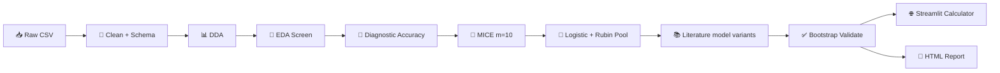

# 🧠 meningioma-atypier

> MRI-based research pipeline for meningioma atypia — from messy clinical spreadsheets to pooled logistic models, literature-aligned multivariable comparisons, and a clinician-facing risk calculator.

---

## 🎯 What this project does

**Primary outcome:** estimate the probability of **high-grade meningioma** (WHO grade 2–3) from pre-operative MRI and clinical variables.

The workflow is deliberately **statistics-first, not black-box ML**:

1. 🧹 Clean and type clinical data with an explicit schema (row filters, derivations, pre-schema category cleanup)
2. 🔍 Screen univariate associations (EDA + paper-style diagnostic accuracy)
3. 🧩 Impute missing values with MICE, then pool uncertainty with Rubin's rules
4. 📐 Fit **one or more** multivariable logistic models — your experimental predictor set plus published predictor sets from the literature
5. ✅ Validate internally (bootstrap optimism correction + shrinkage) per model variant
6. 🌐 Ship a **Streamlit calculator** driven by portable JSON model artifacts
7. 📄 Generate a self-contained **HTML report** with collapsible sections, inline formula glossaries, and interpretation dropdowns

> ⚠️ **Research tool, not a standalone clinical decision system.** External validation on an independent cohort is required before any clinical use.

---

## 🧬 Dataset

~**400 meningioma cases** (PSKUS cohort export), including:

| Domain | Examples |
|--------|----------|
| 🩻 MRI morphology | tumor volume, margin, dural tail, DWI/T2/T1 signal, ADC |
| 🧪 Histopathology | WHO grade, Ki-67, progesterone receptor, necrosis |
| 🧠 Invasion patterns | brain invasion, sinus invasion, cortical destruction |
| 📏 Size & location | max diameter, skull-base vs non-skull-base, laterality |
| 👤 Demographics | age, sex, multiple meningiomas |

Raw file: `heavy_machinery/Meningiomas PSKUS grants - Visi pacienti.csv`

---

## 🗂️ Repository layout

```
meningioma-atypier/
├── app.py                          # 🌐 Streamlit calculator entry point
├── model_artifacts/
│   ├── high_grade_model.json       # 📦 Primary deployed calculator artifact
│   └── high_grade__*_model.json    # 📦 One JSON per inferential model variant
├── heavy_machinery/
│   ├── meningioma-cleaning.ipynb   # 🧹 Cohort cleaning → datasets (run first)
│   ├── meningioma-modelling.ipynb  # 🧠 EDA + multivariable + report (run second)
│   ├── cleaning.py                 # 🧹 Schema application, derivations, export
│   ├── schema_infer.py             # 🔎 Auto-detect column types + overrides
│   ├── dataset_handoff.py          # 🔗 Parquet handoff validation (cleaning → modelling)
│   ├── dda.py                      # 📊 Data discovery & distribution plots
│   ├── eda.py                      # 🔗 Univariate association screening (+ ROC-AUC column)
│   ├── diagnostic_accuracy.py      # 🎯 Paper-style 2×2 metrics (sensitivity, PPV, Wilson CIs…)
│   ├── missingness_resolution.py   # 🧩 MICE (OS-aware parallel imputation + dtype restore)
│   ├── inferential.py              # 📐 Rubin-pooled multivariable logistic regression (multi-variant)
│   ├── model_validation.py         # ✅ Bootstrap internal validation + shrinkage
│   ├── model_calculator.py         # 🧮 JSON artifact → Streamlit UI + artifact export
│   ├── report.py                   # 📄 Collapsible HTML report builder
│   ├── config/                     # ⚙️ Cohort, rename map, missingness policy, analysis
│   └── output/                     # 📁 Generated tables, figures, report
└── pytests_atypier/                # 🧪 200+ automated tests
```

---

## 🛠️ Pipeline at a glance



| Stage | Module | What it produces |
|-------|--------|------------------|
| 01–06 | `config/` + `cleaning.py` | Typed cohort, cleaning log, derived columns |
| 07 | `dda.py` | Per-column distribution stats + SVG histograms |
| 08 | `missingness_resolution.py` | Missingness heatmap, MICE imputed frames |
| 09–10 | `eda.py` | Association table + per-pair plots (FDR-corrected) |
| 09b | `diagnostic_accuracy.py` | Sensitivity / specificity / PPV / NPV / Wilson CIs per feature |
| 11–12 | `inferential.py` | Adjusted ORs, VIF, forest plot — **one block per model variant** |
| 12b | `model_validation.py` | Optimism-corrected AUC, Brier, calibration slope |
| 13 | `report.py` | `output/report/report.html` (collapsible sections) |
| 🌐 | `app.py` | Interactive risk calculator |

### 📚 Multiple multivariable models

In `meningioma-modelling.ipynb` (§03), configure three separate lists:

| Cell | Variable | Purpose |
|------|----------|---------|
| EDA | `EDA_TARGETS`, `EDA_PREDICTORS` | Wide univariate screening pool |
| Literature | `LITERATURE_MODEL_VARIANTS` | Published predictor sets to replicate |
| Experimental | `EXPERIMENTAL_MODEL_VARIANTS` | Your own models (any count; each with its own target + predictors) |

Each variant is `(id, title, link, target, [predictors])` or an equivalent dict. Experimental ids must be `experimental` or start with `experimental_` so the report groups them under 🧪.

A resolve cell merges literature + experimental lists, filters to columns present in `df`, and derives `INFERENTIAL_TARGETS`. Run `load("07_analysis").print_copy_pasteable_columns(df)` in §03 to copy column names into your lists.

Each variant gets its own:

- EPV stability gauge (threshold marker at **EPV = 10**)
- Rubin-pooled coefficient table + forest plot
- VIF diagnostics (collapsed by default)
- Per-variant `*__calculator.json` → `model_artifacts/<target>_<id>_model.json`

Re-running §06 **deletes stale per-variant inferential files** before writing new ones (renamed or removed models no longer appear in the report).

Built-in literature examples mirror published meningioma grading models (Yao et al. 2022, Amano et al. 2021, Radeesri & Lekhavat 2020, Azeemuddin et al. 2018, Peng et al. 2021).

---

## 📐 Statistical methods (short & honest)

Each choice exists because clinical data is **small-N, missing, and multi-tested** — not because it sounds impressive.

### 🔗 Univariate screening (`eda.py`)

| Comparison | Test | Why |
|------------|------|-----|
| Continuous vs binary outcome | **Mann–Whitney U** | Non-parametric; robust to skewed tumor volumes and ADC values. Effect: rank-biserial *r* = 1 − 2U/(n₁·n₀). |
| Ordinal vs binary | **Spearman ρ** | Uses rank order without assuming equal spacing between WHO-style categories. |
| Nominal vs binary | **χ²** (or **Fisher exact** if sparse) | Tests independence in the 2×K table. Effect: **Cramér's V** = √(χ² / n·min(r−1, c−1)). |
| Multiple predictors per target | **Benjamini–Hochberg FDR** | Controls false discoveries across dozens of MRI features: qᵢ = min_{k≥i} p₍ₖ₎·m/k. |
| Binary predictor vs binary outcome | **ROC-AUC** (`auc_univariate`) | Proper rank-based discrimination for the EDA table (distinct from the diagnostic-accuracy shortcut below). |

### 🎯 Diagnostic accuracy (`diagnostic_accuracy.py`)

Separate from multivariable modelling. For each binary MRI sign vs binary outcome:

- **Sensitivity** = TP / (TP + FN)
- **Specificity** = TN / (TN + FP)
- **PPV / NPV** with **Wilson 95% CIs**
- **AUC** = (sensitivity + specificity) / 2 — a quick univariate summary aligned with radiology association tables (e.g. Upreti et al., *Neuroradiology* 2024), not full ROC-AUC

The HTML report renders this as a collapsible **"Like in that research"** table per target.

### 🧩 Missing data (`missingness_resolution.py`)

- **MICE** (default m = 10 imputations): chained equations fill missing values while preserving relationships between variables.
- **Parallel execution:** imputations run in parallel via `joblib` (one draw per worker); random-forest `n_jobs` is capped per OS to avoid CPU oversubscription, overheating, and nested parallelism stalls on Windows/macOS.
- **OS-aware defaults:** Windows uses conservative settings (up to 4 parallel imputations, 3 RF jobs, 12 worker-slot cap); macOS is thermals/battery-conscious (fewer slots on battery).
- **Post-imputation:** dtypes restored to match the original cohort (`Categorical`, nullable `Float64`); categorical level integrity validated before return.
- **Why multiple imputations?** Single imputation treats imputed values as known → **standard errors are too small**. Rubin pooling fixes that.
- **Binary imaging signs** are generally **not imputed** — missing means unrecorded/unknown, not confirmed absence. Models using them fit on complete cases.

**Notebook profiles** (§11 `mice_impute` cell):

| Profile | `m` | `max_iter` | `n_estimators` |
|---------|-----|------------|----------------|
| Fast iteration | 3 | 10 | 20 |
| Publication | 10 | 25 | 50 |

Optional: `max_worker_slots=4` (safer laptop), `emergency_safe_mode=True` (serial debug).

### 📐 Multivariable model (`inferential.py`)

**Design matrix:**
- Continuous / count → **z-score**: z = (x − μ) / σ → OR is "per 1 SD increase"
- Ordinal → numeric codes (preserves order)
- Nominal → one-hot (drop-first reference)
- Binary → 0/1

**Collinearity:** iteratively drop predictors with **VIF > 5**.

**Sample-size guard:** EPV = events ÷ design columns. Report flags **≥ 10 stable**, **5–10 borderline**, **< 5 underpowered**.

**Rubin pooling** across m = 10 imputed fits with **Barnard–Rubin** degrees of freedom.

### ✅ Internal validation (`model_validation.py`)

- **Bootstrap optimism correction** (1000 resamples)
- **AUC**, **Brier score**, **calibration slope**
- **Shrinkage + intercept recalibration** → exported into each Streamlit JSON artifact

---

## ⚡ Quick start

### 1️⃣ Install

```bash
cd meningioma-atypier
pip install -r requirements.txt
```

### 2️⃣ Run the pipeline (notebooks)

```bash
cd heavy_machinery
jupyter notebook meningioma-cleaning.ipynb   # 1. cleaning → output/datasets/
jupyter notebook meningioma-modelling.ipynb  # 2. analysis → output/report/
```

Run each notebook top to bottom. Cleaning writes handoff parquets under `output/datasets/`; modelling loads them and must **not** wipe `output/`. Edit `LITERATURE_MODEL_VARIANTS` and `EXPERIMENTAL_MODEL_VARIANTS` in modelling §03 before §06 multivariable cells.

### 3️⃣ Launch the calculator

```bash
streamlit run app.py
```

By default the app loads `model_artifacts/high_grade_model.json`. Pass a different artifact path to `render_model_calculator()` if you wire a model selector later.

### 4️⃣ Run tests

```bash
python -m pytest
```

---

## 📦 Key outputs

| Path | Contents |
|------|----------|
| `output/eda/tables/associations.csv` | Univariate tests + FDR q-values + `auc_univariate` |
| `output/eda/tables/diagnostic_accuracy.csv` | Sensitivity, specificity, PPV, NPV, Wilson CIs |
| `output/inferential/tables/<target>__<model_id>__multivariable.csv` | Adjusted ORs with 95% CI per variant |
| `output/inferential/tables/inferential_summary.csv` | All variants combined |
| `output/inferential/tables/multivariable_cases.csv` | EPV / complete-case counts per variant |
| `output/inferential/figures/<target>__<model_id>__forest.svg` | Forest plot (log-scale OR axis) |
| `output/report/report.html` | Full narrative report — major sections collapse/expand |
| `model_artifacts/high_grade_<model_id>_model.json` | Streamlit-ready shrunken model per variant |

---

## 📄 HTML report

`report.py` assembles a self-contained document aimed at a clinician-researcher audience:

- **Collapsible major sections** (cleaning, schema, DDA, missingness, EDA, multivariable, appendix)
- **Multivariable section:** nested 📚 Literature-based models and 🧪 Experimental model dropdowns per target
- **Single metrics glossary** (📖 *What do these metrics mean?*) at the end of each major section — styled smaller than model dropdowns
- **Scrollable wide tables** instead of page-wide horizontal scroll
- **Interpretation dropdowns** per EDA target and per inferential model variant
- **Schema table** fades `keep=False` columns; long level lists collapse behind expanders

Interpretation lives next to each table; there is no standalone "final conclusions" section.

---

## 🧠 Tech stack

| Layer | Tools |
|-------|-------|
| Data | pandas, numpy, openpyxl |
| Statistics | scipy, statsmodels |
| Imputation & metrics | scikit-learn, joblib |
| Visualization | matplotlib, seaborn |
| Deployment | Streamlit |
| Quality | pytest |

---

## 🧭 Philosophy

- **Clean data before clever models** — schema, missingness policy, and audit logs are first-class outputs, not afterthoughts.
- **Interpretability over complexity** — pooled logistic regression with explicit ORs beats opaque ensembles for a manuscript and for clinicians.
- **Compare against the literature** — replicate published predictor sets on your cohort before trusting a bespoke model.
- **Honest uncertainty** — MICE + Rubin pooling + bootstrap correction acknowledge that N is modest and data is incomplete.
- **Reproducible artifacts** — JSON model files decouple statistical fitting from the Streamlit UI.

---

## 🔮 Status

🟢 **Active research pipeline** — two-notebook workflow (cleaning → modelling), multi-variant inferential modelling, handoff validation, report, and calculator are implemented and tested.

Streamlit artifacts are exported per model variant under `model_artifacts/` (e.g. `high_grade_experimental_model_1_model.json`). The default app entry point still resolves `high_grade_model.json` when present; otherwise use the newest artifact or pass an explicit path to `render_model_calculator()`.

---

## 📚 Reference style

Univariate diagnostic screening follows the spirit of radiology association tables (e.g. Upreti et al., *Neuroradiology* 2024). Multivariable methods follow standard biostatistics practice: Rubin (1987) pooling, Barnard–Rubin (1999) df, VIF threshold 5 for collinearity, EPV ≥ 10 as the stability rule of thumb (Peduzzi et al.).

---

## 📖 Formula guide — DDA, EDA, MICE, inferential

Plain-language notes on **what each number means**, **how it is computed**, and **why this pipeline picked it** over the usual alternatives. The HTML report embeds shorter versions of these glossaries next to each section.

---

### 📊 DDA — Descriptive Data Analysis (`dda.py`)

**Purpose:** understand each column *before* any testing or modelling. No p-values here — only "what does the data actually look like?"

| Formula | How it works (brief) | Why here (vs alternatives) |
|---------|----------------------|----------------------------|
| **Missing %** = missing ÷ n × 100 | Share of empty cells per column. | Flags which MRI fields are unusable as-is. **Alternative:** ignore missing until modelling crashes — loses time and hides structural gaps (e.g. ADC only measured when DWI was done). |
| **Median, IQR** (Q3 − Q1) | Middle value; box spans the central 50%. | Tumor volume and edema are often **right-skewed** — one giant meningioma should not define "typical." **Alternative:** mean ± SD assumes symmetry; misleading here. |
| **Mean, trimmed mean** (10% tails cut) | Average; trimmed version drops extreme 5% from each end. | Mean is still useful for reporting; trimmed mean is a **robust** check that outliers are not driving the average. **Alternative:** winsorizing — similar idea, trimming is simpler to explain in a paper. |
| **Std, CV** = std ÷ mean | Spread; CV compares spread relative to size. | CV lets you compare variability across variables on different scales (mm vs cm³). **Alternative:** raw std alone — hard to compare ADC (≈1) with volume (≈100). |
| **Skewness, kurtosis** | Skew = tail heaviness on one side; kurtosis = tail weight vs normal (0 = normal-like). | Early warning for "this needs a non-parametric test later." **Alternative:** eyeballing histograms only — easy to miss in 40+ columns; numbers scale better. |
| **Mode %, class imbalance** = top count ÷ rarest count | How dominant the most common category is. | Catches degenerate fields (e.g. 98% "absent") before χ² tests fail. **Alternative:** plotting only — tables catch imbalance across the whole schema at once. |
| **Entropy** H = −Σ p·log₂(p); **balance** = H ÷ log₂(k) | H measures category diversity; balance scales it 0 (one class) → 1 (even split). | Quantifies whether a nominal field carries information or is nearly constant. **Alternative:** counting levels manually — entropy summarizes imbalance in one number. |
| **Histogram + KDE, boxplot** | Bar counts per bin; smooth curve over the shape; box shows median and outliers. | Visual sanity check alongside the table — spots bimodality, typos, impossible values. **Alternative:** summary stats alone — miss two-peaked ADC distributions or data-entry spikes. |

---

### 🔗 EDA — Exploratory Association Screening (`eda.py`)

**Purpose:** for each target × predictor pair, ask "is there *any* signal worth a closer look?" Tests are **univariate** (one predictor at a time) and p-values are **FDR-corrected per target**.

| Formula | How it works (brief) | Why here (vs alternatives) |
|---------|----------------------|----------------------------|
| **Mann–Whitney U**; effect **r** = 1 − 2U/(n₁·n₀) | Ranks all values, compares ranks between outcome groups. *r* ≈ 0 means no separation, \|r\| near 1 means strong separation. | Continuous MRI measures vs binary outcome (e.g. high-grade yes/no) are **skewed and modest-N**. **Alternative:** two-sample *t*-test assumes normality and equal variance — brittle on tumor volumes. |
| **Spearman ρ** | Correlation on **ranks**, not raw values. ρ ∈ [−1, 1]. | Ordinal predictors (age bins, Ki-67 groups) are ordered but not evenly spaced. **Alternative:** Pearson *r* assumes linearity and equal spacing — wrong for ordered categories. |
| **χ² test**; **Cramér's V** = √(χ² / n·min(r−1,c−1)) | Compares observed vs expected counts in a cross-tab; V scales association 0 → 1. | Nominal MRI signs vs binary outcome — standard "are these patterns linked?" test. **Alternative:** ignoring sparse cells — χ² breaks when expected counts < 5. |
| **Fisher exact** (2×2, sparse cells) | Exact probability for the table — no large-sample approximation. | Used automatically when counts are tiny (rare imaging signs). **Alternative:** forcing χ² on sparse data — inflated false positives. |
| **Kruskal–Wallis**; **ε²** = (H − k + 1)/(n − 1) | Non-parametric "are group medians different?" across 3+ groups. ε² is a simple effect size. | Continuous predictor vs multi-level outcome, or grouped comparisons. **Alternative:** one-way ANOVA — same normality problem as the *t*-test. |
| **Benjamini–Hochberg FDR** qᵢ = min_{k≥i} p₍ₖ₎·m/k | Adjusts p-values so ~5% of "significant" calls are expected false discoveries, not 5% of all tests. | Dozens of MRI features × several targets — uncorrected testing would flood false positives. **Alternative:** Bonferroni (divide α by m) — far too strict, kills real signals in exploratory radiology screens. |
| **ROC-AUC** (`auc_univariate`) | Rank-based area under the ROC curve for binary predictor vs binary outcome; flipped if < 0.5. | Adds a discrimination column comparable across binary signs. **Alternative:** only p-values — two features with similar p can differ sharply in clinical separation. |

---

### 🎯 Diagnostic accuracy (`diagnostic_accuracy.py`)

**Purpose:** radiology-style 2×2 performance metrics per binary imaging sign — complementary to EDA, not a substitute for multivariable modelling.

| Formula | How it works (brief) | Why here (vs alternatives) |
|---------|----------------------|----------------------------|
| **Sensitivity / specificity** | TP rate and TN rate from a 2×2 table. | Directly maps to "how often does this sign flag high-grade?" **Alternative:** only ORs from EDA — harder to compare with published radiology tables. |
| **Wilson 95% CI** | Binomial CI for proportions; stable at small n. | Cohort sizes per sign are modest; normal approximation CIs can go outside [0, 1]. **Alternative:** Wald interval — unreliable when events are rare. |
| **AUC** = (sens + spec) / 2 | Quick univariate summary used in several meningioma imaging papers. | Matches literature tables for side-by-side comparison. **Alternative:** full ROC-AUC — better statistically, but not what those papers report; EDA already carries ROC-AUC separately. |

---

### 🧩 MICE — Multiple Imputation (`missingness_resolution.py`)

**Purpose:** fill missing MRI/clinical values **without pretending we know the true value exactly**, then carry that uncertainty into the regression.

| Formula / step | How it works (brief) | Why here (vs alternatives) |
|----------------|----------------------|----------------------------|
| **Missingness heatmap** (co-missing %) | Shows which columns tend to go missing together. | Reveals structural patterns (e.g. ADC missing when DWI wasn't done) — informs the missingness policy. **Alternative:** column-wise % only — miss correlated gaps. |
| **MICE** (m = 10 datasets) | Each missing value is predicted from the other columns, round by round, until stable. Repeat with 10 different random seeds → 10 full datasets. | Preserves relationships between variables (tumor size ↔ edema, location ↔ skull-base signs). **Alternative:** fill everything with the column median — fast, but destroys correlations and makes downstream models overconfident. |
| **Parallel imputations (`joblib`)** | The m draws run in parallel; each draw uses a capped `RandomForestRegressor(n_jobs=…)` so total worker slots stay within OS/CPU limits. | **Alternative:** serial imputations with `n_jobs=-1` inside one RF — imputations wait in line while one forest hogs all cores; nested parallelism can slow Windows/macOS laptops. |
| **OS-aware parallelism** | `platform.system()` picks conservative defaults; macOS on battery uses a low-power profile; optional `max_worker_slots` / `emergency_safe_mode`. | Protects thermals and battery without hand-tuning every machine. **Alternative:** hostname-specific profiles — brittle and not portable. |
| **Iterative imputer + random forest** | Inner engine: a small random forest predicts each column from the rest, iteratively updating all missing cells. | Handles **mixed types** (numeric + categorical) in one pass. **Alternative:** linear regression imputation — assumes linearity; poor for binary signs and skewed volumes. |
| **Categorical encode → impute → decode** | Nominal/ordinal levels become integer codes for imputation, then mapped back to labels; dtypes restored (`Categorical`, `Float64`) before return. | Keeps "skull base" as a category, not a meaningless number. **Alternative:** imputing raw strings — most algorithms cannot; imputing as free numeric codes — invents nonsense levels. |
| **Binary left NaN in screening** (`simple_impute`) | Fast single-fill for EDA only: median/mode; binaries stay missing unless explicitly allowed. | "Unknown" ≠ "absent" for imaging signs. **Alternative:** imputing binary as 0 — treats "not recorded" as "definitely negative," which biases association screens. |
| **Why m = 10?** | Rubin: efficiency ≈ (1 + fmi/m)⁻¹. At ~30% missing info, m = 10 recovers ~97% of full efficiency. | Enough copies for stable pooled SEs without 10× runtime cost. **Alternative:** m = 1 (single imputation) — SEs too narrow, invalid inference; m = 50 — diminishing returns for this cohort size. |

---

### 📐 Inferential — Multivariable Logistic Regression (`inferential.py`)

**Purpose:** estimate **adjusted** odds ratios — "if we hold all other MRI signs constant, what does this one contribute to high-grade risk?" Results are **Rubin-pooled** across the 10 imputed datasets. Run multiple **variants** to compare your cohort against published predictor sets.

| Formula | How it works (brief) | Why here (vs alternatives) |
|---------|----------------------|----------------------------|
| **Z-score** z = (x − μ) / σ | Rescales continuous variables to "how many SDs above cohort average." | OR becomes "per 1 SD increase" — comparable across tumor volume, ADC, and diameter. **Alternative:** raw units — OR for volume (per cm³) vs ADC (per 10⁻³ mm²/s) are not comparable on a forest plot. |
| **One-hot encoding** (drop-first) | Each nominal level becomes 0/1 vs a reference category. | Location and margin are categories, not numbers. **Alternative:** integer coding (1,2,3…) — implies equal spacing between "skull base" and "convexity," which is wrong. |
| **VIF** = 1 / (1 − R²ⱼ); drop if > 5 | Measures how much predictor j overlaps with the others. High VIF → unstable coefficients. | MRI signs cluster (e.g. necrosis + heterogeneous enhancement). **Alternative:** keep all collinear terms — huge CIs and uninterpretable ORs; **LASSO** — drops variables but hides *why* they left. |
| **Logistic model** P = 1 / (1 + e^(−linear sum)) | Linear combination of predictors squeezed into a 0–1 probability. | Standard for binary outcomes in clinical research — ORs are directly publishable. **Alternative:** random forest / XGBoost — may score better but offers no transparent adjusted OR for the manuscript or calculator. |
| **Adjusted OR** = e^β | Multiplicative change in odds per unit of encoded predictor, others held fixed. | Clinicians think in "odds of high-grade if sign present vs absent." **Alternative:** reporting only raw coefficients — not intuitive at the bedside. |
| **Rubin pooling** θ̄ = mean(θᵢ); T = W + (1 + 1/m)·B | Average coefficient across 10 imputations; total variance = within-model noise + between-imputation noise. | Only statistically valid way to merge MI results. **Alternative:** fit on one imputed set — ignores imputation uncertainty; **complete-case** — throws away ~30% of patients and can bias if missing is not random. |
| **Barnard–Rubin df** | Small-sample correction for p-values and CIs when m is modest (here m = 10). | Original Rubin df → ∞ too easily when between-variance is small. **Alternative:** normal z-test after MI — anti-conservative with small m. |
| **Forest plot (log-scale OR)** | OR = 1 is null; CI crossing 1 means "not clearly different." Log axis keeps symmetric CIs readable. | Standard visual for multivariable clinical papers. **Alternative:** linear OR axis — squashes large ORs and stretches small ones, harder to read. |
| **EPV check** (events per variable) | Events ÷ number of design columns in the final model. | With ~100 high-grade cases and many MRI features, overfitting is a real risk. Report marks **≥ 10 stable**, **5–10 borderline**, **< 5 underpowered**. **Alternative:** throwing in 30 predictors — apparent fit, nonsense coefficients. |
