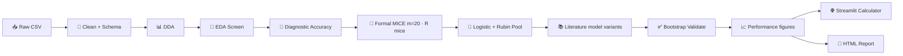

# 🧠 meningioma-atypier

> MRI-based research pipeline for meningioma atypia — from messy clinical spreadsheets to pooled logistic models, literature-aligned multivariable comparisons, and a clinician-facing risk calculator.

---

## 🎯 What this project does

**Primary outcome:** estimate the probability of **high-grade meningioma** (WHO grade 2–3) from pre-operative MRI and clinical variables.

The workflow is deliberately **statistics-first, not black-box ML**:

1. 🧹 Clean and type clinical data with an explicit schema (row filters, derivations)
2. 🔍 Screen univariate associations (EDA + paper-style diagnostic accuracy)
3. 🧩 Impute missing values with formal mixed-type MICE (R `mice`), then pool uncertainty with Rubin's rules
4. 📐 Fit **one or more** multivariable logistic models — your experimental predictor set plus published predictor sets from the literature
5. ✅ Validate internally (bootstrap optimism correction + shrinkage) per model variant
6. 🌐 Ship a **Streamlit calculator** driven by portable JSON model artifacts
7. 📄 Generate a self-contained **HTML report** with collapsible sections, inline formula glossaries, and interpretation dropdowns

> ⚠️ **Research tool, not a standalone clinical decision system.** External validation on an independent cohort is required before any clinical use.

---

## 🧬 Dataset

~**400 meningioma cases** (PSKUS cohort export), including:

| Domain | Examples |
|--------|----------|
| 🩻 MRI morphology | tumor volume, margin, dural tail, DWI/T2/T1 signal, ADC |
| 🧪 Histopathology | WHO grade, Ki-67, progesterone receptor, necrosis |
| 🧠 Invasion patterns | brain invasion, sinus invasion, cortical destruction |
| 📏 Size & location | max diameter, skull-base vs non-skull-base, laterality |
| 👤 Demographics | age, sex, multiple meningiomas |

Default raw file: `heavy_machinery/Meningiomas PSKUS grants - Visi pacienti.csv`. `load("cohort").load_raw(DATA_PATHS)` accepts a **list** of CSV/XLSX paths and stacks them with `pd.concat`. Optional `ANALYSIS_YEARS` (in the cleaning notebook year-filter cell) subsets by entry year via `apply_cohort_year_filter` (`None` = all years).

---

## 🗂️ Repository layout

```
meningioma-atypier/
├── app.py                          # 🌐 Streamlit calculator entry point
├── meningioma-cleaning.ipynb       # 🧹 Cohort cleaning → output/datasets/ (run first)
├── meningioma-modelling.ipynb      # 🧠 EDA + multivariable + report (run second)
├── meningioma-thresholder.ipynb    # 🎯 Cut-points, risk curves, combinations (independent)
├── aesthetics_experiments.ipynb    # 🎨 Local graph / e-poster prototyping (optional, gitignored)
├── pytest.ini                      # 🧪 Test discovery (repo root)
├── pyrightconfig.json              # 🔍 basedpyright extraPaths for phase imports
├── requirements.txt                # 📦 Python dependencies
├── output/                         # 📁 Generated tables, figures, report (gitignored)
│   ├── datasets/                   # Parquet handoff between notebooks
│   ├── dda/
│   │   ├── figures/                # Univariate DDA SVGs
│   │   ├── figures_bivariate/      # Optional bivariate DDA SVGs
│   │   └── figures_trivariate/     # Optional trivariate DDA SVGs
│   ├── eda/
│   │   ├── tables/                 # associations.csv, diagnostic_accuracy.csv
│   │   └── figures/                # per-pair plots + association_heatmap.svg
│   ├── inferential/
│   │   ├── tables/                 # Multivariable CSV + *__calculator.json
│   │   ├── figures/                # Forest, ROC, calibration, decision curve,
│   │   │                           #   and the model-comparison figure
│   │   └── model_artifacts/        # Streamlit JSON per model variant
│   ├── thresholds/                 # 🎯 Threshold phase — read by nothing else
│   │   ├── figures/                # Risk curves, ROC trade-offs, count score
│   │   ├── tables/                 # Cut-points, combinations, stability
│   │   └── manifest.json           # What the run wrote + the settings behind it
│   └── report/report.html
└── heavy_machinery/                # 📚 Pipeline library code
    ├── cleaning_phase/             # 🧹 Schema, cleaning, DDA, MICE, handoff, validation
    │   ├── cleaning.py
    │   ├── schema_infer.py
    │   ├── dda.py
    │   ├── missingness_resolution.py
    │   ├── validation.py
    │   └── dataset_handoff.py
    ├── modelling_phase/            # 🧠 EDA, inferential, validation, report, calculator
    │   ├── eda.py
    │   ├── diagnostic_accuracy.py
    │   ├── inferential.py
    │   ├── model_validation.py
    │   ├── model_calculator.py
    │   ├── performance_plots.py    # 📈 ROC / calibration / decision curve / comparison
    │   ├── plot_style.py           # 🎨 One shared figure toolkit for the whole pipeline
    │   └── report.py
    ├── threshold_phase/            # 🎯 Cut-points, risk curves, multi-cut rules
    │   ├── thresholds.py           # Metric, ROC table, five selection rules, bootstrap
    │   ├── risk_curves.py          # Spline risk curves — the "šķēre" analysis
    │   ├── combinations.py         # AND / OR / count rules + benchmarks
    │   ├── stability.py            # All three re-derived across the MICE draws
    │   ├── artifacts.py            # output/thresholds/ writer + manifest
    │   ├── study.py                # methods facts: read from cleaning, or asked of you
    │   └── threshold_report.py     # 📄 threshold_report.html — seven questions, seven answers
    ├── config/                     # ⚙️ Pipeline config · `load("name")` (no numeric prefixes)
    │   ├── cohort.py               # load_raw + ANALYSIS_YEARS filter
    │   ├── column_rename_map.py
    │   ├── schema_overrides.py
    │   ├── row_filters.py
    │   ├── missingness.py
    │   ├── derivations.py
    │   ├── analysis.py             # EDA / literature / experimental variants
    │   └── report_settings.py
    ├── scripts/run_mice.R          # 🧬 R mice engine (subprocess from Python)
    ├── pytests_atypier/            # 🧪 414 automated tests
    └── pytest.ini                  # Optional: `cd heavy_machinery && python -m pytest`
```

### 📦 Import paths

Run notebooks and commands from the **repo root** (`meningioma-atypier/`, same folder as `app.py`).

| Context | How imports work |
|---------|------------------|
| **Notebooks** | `from heavy_machinery.config import load` and `from heavy_machinery.cleaning_phase…` / `heavy_machinery.modelling_phase…` |
| **Library modules** | Flat sibling imports (`from schema_infer import ColSpec`, `from plot_style import …`) — `heavy_machinery.config` prepends `cleaning_phase/`, `modelling_phase/` and `threshold_phase/` to `sys.path` |
| **pytest** | Root `pytest.ini` → `heavy_machinery/pytests_atypier/` with the same `pythonpath` as above |
| **Type checking** | `pyrightconfig.json` adds phase folders + test package to `extraPaths` |

`output/` and all generated artifacts (including `output/inferential/model_artifacts/`) live at the repo root, not under `heavy_machinery/`.

---

## 🛠️ Pipeline at a glance



| Stage | Module | What it produces |
|-------|--------|------------------|
| Cleaning | `heavy_machinery/config/` + `cleaning_phase/cleaning.py` | Typed cohort, cleaning log (`n_rows` / `n_columns`), derived columns; `schema_coercion.csv` audits value→value changes (incl. → missing) |
| DDA | `cleaning_phase/dda.py` | Per-column distribution stats + one SVG per column; optional **bivariate** (`run_dda_bivariate` → `output/dda/figures_bivariate/`); optional **trivariate** (`run_dda_trivariate` → `output/dda/figures_trivariate/`). Descriptive only — percentages carry their counts and confidence intervals, and no p-values appear |
| Missingness / MICE | `cleaning_phase/missingness_resolution.py` | Missingness bars + co-missingness heatmap, formal MICE imputed frames + diagnostics |
| EDA | `modelling_phase/eda.py` | Association table + per-pair plots (FDR-corrected) + **association-strength heatmap** (`association_heatmap.svg`) |
| Diagnostic accuracy | `modelling_phase/diagnostic_accuracy.py` | Sensitivity / specificity / PPV / NPV / Wilson CIs per feature |
| Inferential | `modelling_phase/inferential.py` | Adjusted ORs, VIF, forest plot (log OR, coloured by direction), Streamlit JSON — **one block per model variant** |
| Performance figures | `modelling_phase/performance_plots.py` | ROC, calibration, and decision curve per variant, plus one **model-comparison** figure ranking every variant on the same cohort |
| Plotting | `modelling_phase/plot_style.py` | **One figure toolkit** for the whole pipeline: SciencePlots `science`+`nature`+`no-latex`, colour-blind-safe palette, print-column sizing, confidence intervals for percentages, reproducible point scatter, and clinician-readable labels for every axis and category |
| Validation | `modelling_phase/model_validation.py` | Optimism-corrected AUC, Brier, calibration slope, plus the calibration and decision-curve data behind the figures → merged into calculator JSON |
| Report | `modelling_phase/report.py` | `output/report/report.html` (collapsible sections) |
| 🌐 | `app.py` | Interactive risk calculator — default `*_experimental_model_1_model.json` |

### 📚 Multiple multivariable models

In `meningioma-modelling.ipynb` (§03), configure three separate lists:

| Cell | Variable | Purpose |
|------|----------|---------|
| EDA | `EDA_TARGETS`, `EDA_PREDICTORS` | Wide univariate screening pool |
| Literature | `LITERATURE_MODEL_VARIANTS` | Published predictor sets to replicate |
| Experimental | `EXPERIMENTAL_MODEL_VARIANTS` | Your own models (any count; each with its own target + predictors) |

Each variant is `(id, title, link, target, [predictors])` or an equivalent dict. Put custom models in `EXPERIMENTAL_MODEL_VARIANTS` — the report groups by list, not by id prefix.

A resolve cell merges literature + experimental lists, filters to columns present in `df`, and derives `INFERENTIAL_TARGETS`. Run `load("analysis").print_copy_pasteable_columns(df)` in §03 to copy column names into your lists.

Each variant gets its own:

- EPV stability gauge (threshold marker at **EPV = 10**; events = **minority** class count ÷ design columns)
- Rubin-pooled coefficient table + forest plot
- VIF diagnostics (collapsed by default)
- Per-variant `*__calculator.json` → `output/inferential/model_artifacts/<target>_<id>_model.json`

Re-running §06 **clears stale per-variant inferential files** (tables, forest plots, and Streamlit JSON) before writing new ones — renamed or removed models no longer appear in the report or calculator.

Built-in literature examples mirror published meningioma grading models (Yao et al. 2022, Amano et al. 2021, Radeesri & Lekhavat 2020, Azeemuddin et al. 2018, Peng et al. 2021).

---

## 📐 Statistical methods (short & honest)

Each choice exists because clinical data is **small-N, missing, and multi-tested** — not because it sounds impressive.

### 🔗 Univariate screening (`modelling_phase/eda.py`)

| Comparison | Test | Why |
|------------|------|-----|
| Continuous vs binary outcome | **Mann–Whitney U** | Non-parametric; robust to skewed tumor volumes and ADC values. Effect: rank-biserial *r* = 2U₁/(n₁·n₀) − 1 (groups always passed as outcome==1, then outcome==0; + ⇒ higher in positive class). |
| Ordinal vs binary | **Spearman ρ** | Uses rank order without assuming equal spacing between WHO-style categories. |
| Nominal vs binary | **χ²** (or **Fisher exact** if sparse) | Tests independence in the 2×K table. Effect: **Cramér's V** = √(χ² / n·min(r−1, c−1)). |
| Multiple predictors per target | **Benjamini–Hochberg FDR** | Controls false discoveries across dozens of MRI features: qᵢ = min_{k≥i} p₍ₖ₎·m/k. |
| Binary predictor vs binary outcome | **ROC-AUC** (`auc_univariate`) | Proper rank-based discrimination for the EDA table (distinct from the diagnostic-accuracy shortcut below). |

### 🎯 Diagnostic accuracy (`modelling_phase/diagnostic_accuracy.py`)

Separate from multivariable modelling. For each binary MRI sign vs binary outcome:

- **Sensitivity** = TP / (TP + FN)
- **Specificity** = TN / (TN + FP)
- **PPV / NPV** with **Wilson 95% CIs**
- **AUC** = (sensitivity + specificity) / 2 — a quick univariate summary aligned with radiology association tables (e.g. Upreti et al., *Neuroradiology* 2024), not full ROC-AUC

The HTML report renders this as a collapsible **"Like in that research"** table per target.

### 🧩 Missing data (`cleaning_phase/missingness_resolution.py`)

- **Primary method — formal mixed-type MICE** (`proper_mice_impute`): one R `mice()` fully-conditional-specification chain imputes each incomplete variable with a model matched to its declared type — continuous/count → **PMM**, binary → **logistic**, nominal → **polytomous**, ordinal → **proportional-odds**. Python calls `Rscript heavy_machinery/scripts/run_mice.R` automatically via `subprocess` (no `rpy2`, no RStudio).
- **Proper uncertainty:** all `m` datasets come from one chain, so between-imputation variance is preserved and the manifest is marked `proper_multiple_imputation=True` / `rubin_pooling_supported=True` — required before Rubin pooling.
- **Derived columns:** non-outcome derived columns are dropped before R and **recreated from their imputed sources** via the notebook's own derivation function (single source of truth); a `DERIVED_DEPENDENCIES` map records the parent→child relationships. The analysis outcome may predict missing predictors but is never imputed, and its source column is excluded as a duplicate.
- **Post-imputation:** dtypes restored to match the original cohort (`Categorical` levels/order, nullable `Float64`/`Int64`/`boolean`); every frame is validated for row identity, unchanged observed cells, legal categories, derived consistency, and **Pandera** — not just the first draw.
- **Diagnostics:** `methods.csv`, `predictor_matrix.csv`, `logged_events.csv`, `chain_diagnostics.png`, `r_session.json`, and `imputed_cell_variation.csv` (how each originally-missing cell varies across draws — a diagnostic, not a CI).
- **Binary imaging signs are now imputed** by logistic regression inside the MICE chain under MAR (conditional on the other predictors), so patients are retained and imputation uncertainty propagates through Rubin pooling. If a sign's missingness is likely informative (MNAR), interpret it with a separate sensitivity analysis.
- **Sensitivity method — RF chained imputation** (`rf_chained_impute`, legacy alias `mice_impute`): random-forest `IterativeImputer` with post-hoc Bernoulli sampling for binary cells, run in parallel via `joblib` with OS-aware CPU/battery limits. Marked `proper_multiple_imputation=False` — **not** valid for Rubin pooling; kept only as a labelled sensitivity analysis.

**Requires R** with the `mice` and `jsonlite` packages (one-time):

```r
install.packages(c("mice", "jsonlite"))
```

**Notebook profiles** (cleaning §12 `proper_mice_impute` cell):

| Profile | `m` | `max_iter` |
|---------|-----|------------|
| Smoke / fast iteration | 3 | 5 |
| Publication | 20 | 20 |

### 📐 Multivariable model (`modelling_phase/inferential.py`)

**Design matrix:**
- Continuous / count → **z-score**: z = (x − μ) / σ → OR is "per 1 SD increase"
- Ordinal → numeric codes (preserves order)
- Nominal → one-hot (drop-first reference)
- Binary → 0/1

**Collinearity:** iteratively drop predictors with **VIF > 5**.

**Sample-size guard:** EPV = minority-class events ÷ design columns. Report flags **≥ 10 stable**, **5–10 borderline**, **< 5 underpowered**.

**Rubin pooling** across the m formal-MICE fits with **Barnard–Rubin** degrees of freedom (only manifests marked `proper_multiple_imputation=True` are pooled; RF sensitivity draws are rejected/flagged).

### ✅ Internal validation (`modelling_phase/model_validation.py`)

Any model looks better on the patients it was built from than it will on the next patient. Bootstrap validation measures **how much of the performance is real** and how much is flattery.

- **Bootstrap optimism correction** (1000 resamples)
- **AUC**, **Brier score**, **calibration slope** — each reported twice: as it appears on the development cohort, and after the optimism is subtracted
- **Shrinkage + intercept recalibration** → exported into each Streamlit JSON artifact
- Feeds the three performance figures below, so the report shows the corrected numbers rather than only the flattering ones

### 🎯 Thresholds (`threshold_phase/`)

An **independent** analysis, driven by `meningioma-thresholder.ipynb`. It reads the same `output/datasets/` handoff and writes only to `output/thresholds/`, which nothing else reads. That separation is structural, not stylistic: a cut-point estimated on this cohort has already seen the outcome, so feeding it back into imputation or the multivariable models would leak the answer into the predictors. Published cut-points are the exception and live in cleaning as derived flags.

Three questions, deliberately kept apart because they are routinely conflated:

**1. Where does risk climb most steeply?** (`risk_curves.py`) — the *"šķēre"*. A logistic regression with the metric entered as a **restricted cubic spline** (Harrell quantile knots; three knots at this sample size, reduced automatically when ties collapse them). Right-skewed metrics are fitted on `log1p(x)` and reported back on the original scale. Outputs, in decreasing order of trustworthiness: the fitted curve with a 95% band and observed proportions in equal-count bins over it; **risk-level crossings** ("risk passes 50% at X"); and the **steepest-rise point**.

A steepest-rise point is only reported as a threshold when it passes two tests: a **likelihood-ratio test of the spline against a straight line** (p < 0.05), and a maximum that is **interior** to the observed range. The first is the subtle one — even a perfectly linear log-odds relationship gives an S-shaped probability curve whose slope peaks at exactly the 50% crossing, carrying no information that crossing does not already carry. Requiring real curvature first is what separates *"risk changes behaviour here"* from *"risk passes one half here"*. Where both tests fail, the module reports that risk rises steadily and refuses to name a threshold.

**2. What is the best single cut-point?** (`thresholds.py`) — the ROC table of every distinguishable cut-point, with five selection rules: `youden`, `closest_01`, `equal_sens_spec`, and the constrained `spec_ge_90` / `sens_ge_90`. Every rule takes a maximum over hundreds of candidates on the data it is then scored on, so each cut-point gets a **percentile bootstrap interval** and an **optimism-corrected Youden J** (Harrell: choose on the resample, score on the original, average the gap). Every cut-point also carries an **odds ratio with a Woolf 95% interval** (Haldane–Anscombe correction when a 2×2 cell is empty), because that is the effect size the meningioma literature quotes for a dichotomised feature — Magill 2018 reports OR 1.69 above 3 cm and 3.01 above 6 cm, and ours are read next to those. Published cut-points are scored alongside without correction — they were not estimated here, which is what makes validating an external cut-point the stronger design. The list of published cut-points and their links lives in the notebook (`LITERATURE_CUTOFFS` / `LITERATURE_LINKS`), with the outcome each was derived against in the label: only Magill's were fitted against WHO grade itself.

**3. Do several cut-points together beat one?** (`combinations.py`) — cut-points are **frozen first**, then only the way of joining them varies: AND, OR, and a count score ("how many of the *k* criteria are met"). Missing flags follow Kleene logic, so `False AND missing` resolves to `False`. Three benchmarks must be cleared before an improvement is claimed: the best single cut-point, a **logistic model on the uncut continuous metrics**, and the **selection optimism** of picking the winner off a menu — reported with a `winner_stability` figure, since a "best combination" that wins under half the resamples is a coin toss rather than a finding.

`threshold_report.py` assembles `output/thresholds/threshold_report.html` from those artifacts — no refitting, so the document and the CSVs can never disagree. It is deliberately short and written for a radiologist rather than a statistician: **seven questions**, each with a two-sentence method note, one figure, one table and one answer templated from the numbers. Detail figures sit behind folds; **§8 is a copy-paste abstract block**. **§9 is the methods section** — `study.py` reads the WHO edition, the inclusion flow and every derived measurement's source back out of `output/cleaning/`, so they cannot drift from what the code did, and lists the four acquisition facts that are not in any file (histology blinding, DWI b-values, ADC ROI, volumetry) as open questions until `STUDY_FACTS` in the notebook answers them. Regenerate any time with `python heavy_machinery/threshold_phase/threshold_report.py --output-root output`.

All three are re-derived on each of the *m* MICE draws (`stability.py`). Two uncertainties then sit side by side: the bootstrap covers sampling noise, the across-draw spread covers the missing data. ⚠️ The across-draw spread is **between-imputation variance only, not Rubin pooling** — a cut-point chosen by maximising J has neither a normal sampling distribution nor a within-imputation variance to combine, so it is a stability check and must never be quoted as a confidence interval.

---

---

## 📊 What the figures tell you

Every figure is exported as an SVG (sharp at any size — fine for a poster or a journal), in one shared visual style, and each one names the numbers behind it so it can stand on its own in a slide deck.

### Describing the cohort (`output/dda/`)

| Figure | The question it answers |
|--------|-------------------------|
| **Distribution** (one per numeric column) | What does this measurement look like across our patients? Shows every patient as a dot, a box for the middle 50%, and the histogram — so an unusual spread or a data-entry error is visible immediately. |
| **Bar charts** (one per category column) | How common is each category? Bars show the percentage, the error bar shows how uncertain that percentage is given the numbers, and each bar is labelled with the actual count (`41% (93/243)`). |
| **Timeline** (dates) | When were these patients scanned? Months with no scans stay visible as gaps rather than being quietly squeezed out, so recruitment pauses are honest. |
| **Bivariate / trivariate** (optional) | Do two or three things move together? Continuous pairs get a scatter with a flexible trend line; groups get side-by-side distributions; categories get percentages with error bars. |

These are **descriptive only** — no p-values, nothing being "tested". They exist so you can see the data before anything is claimed about it.

### Screening one predictor at a time (`output/eda/`)

| Figure | The question it answers |
|--------|-------------------------|
| **Per-pair figures** | Does this single MRI sign or measurement differ between grades? Each figure states its own test, effect size, and corrected p-value on the figure itself, so a picture and a table can never disagree. |
| **Association heatmap** | Which predictors look promising overall? One colour grid across all predictors and outcomes. Cells with a **hatched pattern** carry strength but no direction, so a strong colour there does not mean "higher risk". |

### Judging the models (`output/inferential/`)

| Figure | The question it answers |
|--------|-------------------------|
| **Forest plot** (one per model) | Which signs matter, and in which direction? Orange = raises the odds of high grade, blue = lowers them. A bar crossing the dashed line means the evidence is not clear either way. Strongest effect on top. The heading carries the number of patients, the number of high-grade cases, and the sample-size check. |
| **ROC** | Can the model tell higher-risk from lower-risk patients? A curve hugging the top-left is good; the diagonal is a coin flip. Both the raw and the corrected score are shown. |
| **Calibration** | **When the model says 30%, is it really about 30%?** Patients are grouped into ten risk bands and plotted against the ideal diagonal. This is the figure that matters most if the model is used as a calculator. |
| **Decision curve** | Is acting on this model actually better than the simple alternatives — scanning/treating everyone, or no one? The model is worth using only where its line sits above both. |
| **Model comparison** (one per outcome) | Which of the published and experimental models works best **on our patients**? All variants on the same three scales. The hollow marker is the flattering in-house score, the filled marker is the corrected one — the gap between them is how much each model was overfitting. |

The performance figures are all measured on the same patients the models were built from, so they are optimistic by nature. Each one says so, and prints the corrected value next to the raw one.

---

## ⚡ Quick start

### 1️⃣ Install

**Python 3.11+** recommended (devcontainer uses 3.11; tested on 3.12).

```bash
cd meningioma-atypier
pip install -r requirements.txt
```

**R is required for formal MICE** (`proper_mice_impute`). Install R, then the two R packages once:

```bash
# macOS: brew install r   (or download from https://cran.r-project.org)
Rscript -e 'install.packages(c("mice","jsonlite"), repos="https://cloud.r-project.org")'
```

**Versions (developed & tested with):**

| Component | Tested | Minimum |
|-----------|--------|---------|
| R         | 4.6.1  | ≥ 4.1   |
| `mice`    | 3.19.0 | ≥ 3.16  |
| `jsonlite`| 2.0.0  | ≥ 1.8   |

The exact R/package versions used for a run are recorded automatically in `output/missingness/mice/r_session.json` and in the MICE manifest (`r_version`, `mice_version`). The Python-side versions the suite was last verified green on are listed at the top of `requirements.txt`; per-run versions land in the report appendix.

Verify both are available (Python runs this check automatically before imputing):

```bash
Rscript -e 'cat("R:", as.character(getRversion()), "| mice:", as.character(packageVersion("mice")), "| jsonlite:", as.character(packageVersion("jsonlite")), "\n")'
```

> The RF sensitivity method (`rf_chained_impute`) is pure Python and needs no R.

### 2️⃣ Run the pipeline (notebooks)

```bash
cd meningioma-atypier
jupyter notebook meningioma-cleaning.ipynb   # 1. cleaning → output/datasets/
jupyter notebook meningioma-modelling.ipynb  # 2. analysis → output/report/
jupyter notebook meningioma-thresholder.ipynb # 3. thresholds → output/thresholds/ (optional)
```

Run each notebook top to bottom from the **repo root** (not inside `heavy_machinery/`). Cleaning writes handoff parquets under `output/datasets/`; modelling loads them and must **not** wipe `output/`. Edit `LITERATURE_MODEL_VARIANTS` and `EXPERIMENTAL_MODEL_VARIANTS` in modelling §03 before §06 multivariable cells.

### 3️⃣ Launch the calculator

```bash
streamlit run app.py
```

By default the app resolves the newest `output/inferential/model_artifacts/*_experimental_model_1_model.json` (`CALCULATOR_MODEL_ID` in `model_calculator.py`). Pass an explicit path to `render_model_calculator()` to select another variant.

### 4️⃣ Run tests

```bash
python -m pytest                    # from repo root
cd heavy_machinery && python -m pytest   # from library folder
```

---

## 📦 Key outputs

| Path | Contents |
|------|----------|
| `output/datasets/unimputed_df.parquet` | Typed cohort after cleaning — DDA / EDA / diagnostic accuracy |
| `output/datasets/mice_imputed_df.parquet` | Representative formal-MICE draw for quick modelling checks |
| `output/datasets/simple_imputed_df.parquet` | Simple-impute cohort (EDA shortcut only; not for Rubin pooling) |
| `output/datasets/manifest.json` | Dtype manifest for parquet roundtrip validation (`cleaning_phase/dataset_handoff.py`) |
| `output/missingness/mice/imputed_*.parquet` | All `m` formal-MICE draws used for Rubin pooling |
| `output/missingness/mice/manifest.json` | MICE engine metadata (R / package versions, `m`, seed, Rubin flag) |
| `output/missingness/mice/r_session.json` | R session snapshot recorded at imputation time |
| `output/dda/figures/` | One SVG per column — distribution, bar chart, or timeline |
| `output/dda/figures_bivariate/` | Optional bivariate DDA SVGs (`{x}__by__{partner}.svg`) |
| `output/dda/figures_trivariate/` | Optional trivariate DDA SVGs (`{x}__vs__{y}__by__{group}.svg`) |
| `output/eda/tables/associations.csv` | Univariate tests + FDR q-values + `auc_univariate` |
| `output/eda/figures/` | One figure per target × predictor pair, each labelled with its own test result |
| `output/eda/figures/association_heatmap.svg` | Overview grid (* = survives multiple-testing correction; hatched = strength without direction) |
| `output/eda/tables/diagnostic_accuracy.csv` | Sensitivity, specificity, PPV, NPV, Wilson CIs |
| `output/inferential/tables/<target>__<model_id>__multivariable.csv` | Adjusted ORs with 95% CI per variant |
| `output/inferential/tables/<target>__<model_id>__vif.csv` | VIF diagnostics per variant (also in report multivariable section) |
| `output/inferential/tables/inferential_summary.csv` | All variants combined (CSV only; not duplicated in the HTML report) |
| `output/inferential/tables/multivariable_cases.csv` | EPV / complete-case counts per variant |
| `output/inferential/figures/<target>__<model_id>__forest.svg` | Forest plot — adjusted ORs, coloured by direction, strongest on top |
| `output/inferential/figures/<target>__<model_id>__roc.svg` | ROC curve with the raw and corrected scores |
| `output/inferential/figures/<target>__<model_id>__calibration.svg` | Predicted vs observed risk — does a stated 30% mean 30%? |
| `output/inferential/figures/<target>__<model_id>__decision_curve.svg` | Whether acting on the model beats treating everyone / no one |
| `output/inferential/figures/<target>__model_comparison.svg` | All model variants ranked side by side on our cohort |
| `output/thresholds/tables/03_risk_curves.csv` | Non-linearity test, steepest-rise point, risk crossings per metric |
| `output/thresholds/tables/07_threshold_summary.csv` | Every metric × rule + published cut-points, with Wilson CIs and optimism-corrected J |
| `output/thresholds/tables/12_combination_menu.csv` | Single / AND / OR / count rules with full 2×2 metrics |
| `output/thresholds/tables/17_combination_verdict.csv` | Does combining beat the best single cut-point, after optimism? |
| `output/thresholds/tables/21_risk_curve_stability.csv` | How often each threshold survives the MICE draws (`knee_rate`) |
| `output/thresholds/tables/26_headline_findings.csv` | One row per metric — the results-paragraph table |
| `output/thresholds/figures/05_risk_curves_panel.svg` | Risk of high grade across the observed range, all metrics |
| `output/thresholds/figures/16_count_score.svg` | Risk by number of criteria met — the clinically usable rule |
| `output/thresholds/threshold_report.html` | Self-contained write-up: seven questions, one figure and one answer each, plus a copy-paste abstract |
| `output/thresholds/manifest.json` | Every artifact the run wrote plus the settings that produced it |
| `output/report/report.html` | Full narrative report — major sections collapse/expand |
| `output/inferential/tables/<target>__<model_id>__calculator.json` | Calculator metadata (intercept, terms, z-scores) per variant |
| `output/inferential/model_artifacts/<target>_<model_id>_model.json` | Streamlit-ready shrunken model with bootstrap validation |

---

## 📄 HTML report

`modelling_phase/report.py` assembles a self-contained document aimed at a clinician-researcher audience:

- **Cover:** `REPORT_TITLE` and comma-separated `REPORT_AUTHOR` byline (set in `meningioma-modelling.ipynb` §07)
- **Collapsible major sections** (cleaning, schema, DDA, missingness, EDA, multivariable, appendix)
- **Coerced value audit** dropdown in Cleaning when `output/cleaning/schema_coercion.csv` is present
- **DDA bivariate block** under 2️⃣ DDA when `output/dda/figures_bivariate/` has SVGs (grouped by the bivariate dict key)
- **DDA trivariate block** under 3️⃣ DDA when `output/dda/figures_trivariate/` has SVGs (grouped by the `(x, y)` pair key)
- **EDA association heatmap** (FDR-focused overview) when `association_heatmap.svg` is present
- **Publication-style figures** via `modelling_phase/plot_style.py` — shared SciencePlots session (`science` + `nature` + `no-latex`), colour-blind-safe palette, single SVG export path, and clinician-friendly labels for both axes and category names (no raw `snake_case` anywhere on a figure)
- **Figures that explain themselves** — sample size, group counts, and (in EDA) the test result sit above each plot, so a figure lifted into a slide deck still carries its numbers
- **Human-readable figure captions** — file stems like `high_grade__experimental_model_1__forest` render as *High-grade — Experimental model 1 — Forest plot*
- **Missingness section:** imputation engine table (R / `mice` / `jsonlite` versions, `m`, seed, Rubin flag) pulled from `manifest.json`
- **Multivariable section:** a **model-comparison figure** at the top of each target (all variants ranked on the same cohort), then nested 📚 Literature-based models and 🧪 Experimental model dropdowns; per variant, a forest plot, VIF diagnostics, and a 📈 **Model performance** dropdown holding its ROC, calibration, and decision curve
- **Single metrics glossary** (📖 *What do these metrics mean?*) at the end of each major section — styled smaller than model dropdowns
- **Scrollable wide tables** instead of page-wide horizontal scroll
- **Interpretation dropdowns** per EDA target and per inferential model variant
- **Schema table** fades `keep=False` columns; long level lists collapse behind expanders
- **Appendix:** artifact-load warnings (when present) and 🖥️ environment / package versions (Python pip packages plus R interpreter and package versions from the formal-MICE manifest)

Interpretation lives next to each table; there is no standalone "final conclusions" section. CSV artifacts such as `inferential_summary.csv` and `*__vif.csv` remain on disk under `output/inferential/tables/` but are not repeated in the appendix.

---

## 🧠 Tech stack

| Layer | Tools |
|-------|-------|
| Data | pandas, numpy, openpyxl, pyarrow |
| Statistics | scipy, statsmodels |
| Imputation (primary) | **R `mice` 3.19** (formal mixed-type MICE, via `Rscript` subprocess) |
| Imputation (sensitivity) & metrics | scikit-learn, joblib |
| Validation | pandera (schema checks) |
| Visualization | matplotlib, seaborn (heatmaps), **SciencePlots** (`science`+`nature`+`no-latex` for all pipeline SVGs), `modelling_phase/plot_style.py` (one shared toolkit: style, palette, print sizing, confidence intervals, labels, SVG export) and `modelling_phase/performance_plots.py` (ROC / calibration / decision curve / model comparison) |
| Deployment | Streamlit |
| Quality | pytest |

---

## 🧭 Philosophy

- **Clean data before clever models** — schema, missingness policy, and audit logs are first-class outputs, not afterthoughts.
- **Interpretability over complexity** — pooled logistic regression with explicit ORs beats opaque ensembles for a manuscript and for clinicians.
- **Compare against the literature** — replicate published predictor sets on your cohort before trusting a bespoke model.
- **Honest uncertainty** — formal mixed-type MICE (R `mice`) + Rubin pooling + bootstrap correction acknowledge that N is modest and data is incomplete.
- **Reproducible artifacts** — JSON model files decouple statistical fitting from the Streamlit UI.

---

## 🔮 Status

🟢 **Stable research pipeline (v1)** — two-notebook workflow at repo root, library under `heavy_machinery/`, formal mixed-type MICE (R `mice`), parquet dataset handoff, multi-variant inferential modelling, publication-ready figures, HTML report, Streamlit calculator, and 267 pytest tests in `heavy_machinery/pytests_atypier/`.

After running modelling §06, Streamlit JSON artifacts live under `output/inferential/model_artifacts/`. `streamlit run app.py` loads the `experimental_model_1` artifact by default.

### Recent changes (main)

| Commit | What landed |
|--------|-------------|
| `4184448` | **Model performance figures** — every model variant now gets a ROC curve, a calibration plot (does a predicted 30% mean 30%?), and a decision curve (is acting on it better than treating everyone or no one?), plus one **model-comparison** figure per outcome ranking all variants on the same cohort. All of it appears in the HTML report under 📈 *Model performance*; previously these numbers existed only inside the Streamlit calculator. New module: `modelling_phase/performance_plots.py`. |
| `4184448` | **Forest plots reworked** — colour now shows direction (raises vs lowers the odds) instead of a pass/fail significance split; rows sort strongest-first so variants are comparable; rescaled predictors say *per 1 SD* so their odds ratio is not misread as per-unit; the heading carries patients, events, and the sample-size check. |
| `4e237c9` · `4184448` | **DDA + EDA figures rebuilt for publication** — percentage bars carry their counts and confidence intervals; distributions show every patient alongside the histogram; overlapping translucent histograms replaced with side-by-side distributions that cannot hide one another; trend lines are flexible rather than forced straight; EDA figures print their own test result; empty months are no longer dropped from timelines; category names read as English. Shared toolkit lives in `plot_style.py`. |
| `64ecbee` | **Unified figure pipeline** in `plot_style.py`: SciencePlots `science`+`nature`+`no-latex` across the whole pipeline; colour-blind-safe palette; shared `save_figure`. `aesthetics_experiments.ipynb` gitignored (local prototyping only). |
| `137b7f9` | **Config modules renamed** — drop numeric prefixes (`01_cohort.py` → `cohort.py`, …); call `load("name")`. Streamlit calculator always resolves `*_experimental_model_1_model.json` (`CALCULATOR_MODEL_ID`). Cleaning summary tracks `n_columns` (not `n_dropped`); cohort year filter logs into drop_log. |
| `a7e03a3` | **Rank-biserial sign fix** in `eda._mwu_with_effect`: Kerby `r = 2U₁/(n₁·n₀) − 1` with groups always `(outcome==1, outcome==0)`; + means higher in the positive class. |
| `e534a58` | **EPV** uses the **minority** class (not the labelled positive class). Richer **bivariate DDA** plots, including continuous partners. |
| `aaa5f0d` | Bivariate DDA distribution plot generation (`run_dda_bivariate` → `output/dda/figures_bivariate/`). |
| `c6dcc1f` | Aesthetics / e-poster graph experiments notebook (local prototyping; now gitignored). |
| `e285589` | Cleaning ingest accepts **multiple** CSV/XLSX inputs. |
| `cca03a5` | Streamlit **`model_artifacts/`** moved under `output/inferential/`. |
| `cadb796` | FDR-focused **EDA association heatmap** + collapsible HTML report sections. |

---

## 📚 Reference style

Univariate diagnostic screening follows the spirit of radiology association tables (e.g. Upreti et al., *Neuroradiology* 2024). Multivariable methods follow standard biostatistics practice: Rubin (1987) pooling, Barnard–Rubin (1999) df, VIF threshold 5 for collinearity, EPV ≥ 10 as the stability rule of thumb (Peduzzi et al.).

---

## 📖 Formula guide — DDA, EDA, MICE, inferential

Plain-language notes on **what each number means**, **how it is computed**, and **why this pipeline picked it** over the usual alternatives. The HTML report embeds shorter versions of these glossaries next to each section.

---

### 📊 DDA — Descriptive Data Analysis (`cleaning_phase/dda.py`)

**Purpose:** understand each column *before* any testing or modelling. No p-values here — only "what does the data actually look like?"

| Formula | How it works (brief) | Why here (vs alternatives) |
|---------|----------------------|----------------------------|
| **Missing %** = missing ÷ n × 100 | Share of empty cells per column. | Flags which MRI fields are unusable as-is. **Alternative:** ignore missing until modelling crashes — loses time and hides structural gaps (e.g. ADC only measured when DWI was done). |
| **Median, IQR** (Q3 − Q1) | Middle value; box spans the central 50%. | Tumor volume and edema are often **right-skewed** — one giant meningioma should not define "typical." **Alternative:** mean ± SD assumes symmetry; misleading here. |
| **Mean, trimmed mean** (10% tails cut) | Average; trimmed version drops extreme 5% from each end. | Mean is still useful for reporting; trimmed mean is a **robust** check that outliers are not driving the average. **Alternative:** winsorizing — similar idea, trimming is simpler to explain in a paper. |
| **Std, CV** = std ÷ mean | Spread; CV compares spread relative to size. | CV lets you compare variability across variables on different scales (mm vs cm³). **Alternative:** raw std alone — hard to compare ADC (≈1) with volume (≈100). |
| **Skewness, kurtosis** | Skew = tail heaviness on one side; kurtosis = tail weight vs normal (0 = normal-like). | Early warning for "this needs a non-parametric test later." **Alternative:** eyeballing histograms only — easy to miss in 40+ columns; numbers scale better. |
| **Mode %, class imbalance** = top count ÷ rarest count | How dominant the most common category is. | Catches degenerate fields (e.g. 98% "absent") before χ² tests fail. **Alternative:** plotting only — tables catch imbalance across the whole schema at once. |
| **Entropy** H = −Σ p·log₂(p); **balance** = H ÷ log₂(k) | H measures category diversity; balance scales it 0 (one class) → 1 (even split). | Quantifies whether a nominal field carries information or is nearly constant. **Alternative:** counting levels manually — entropy summarizes imbalance in one number. |
| **Distribution figure** (numeric columns) | One panel: histogram of counts, a smooth curve over it, and above it a box plot with every patient shown as a dot. | Shape, typical value, spread, and outliers in one glance — spots bimodality, typos, and impossible values. **Alternative:** a separate histogram and box plot — forces the reader to line up two x-axes by eye. |
| **Percentage bars with intervals** (category columns) | Bar height = share of patients; whisker = 95% confidence interval; label = `41% (93/243)`. | A percentage without its denominator is unreadable: 50% of 4 patients and 50% of 300 look identical otherwise. **Alternative:** plain count or proportion bars — hide both the denominator and the uncertainty. |
| **Timeline** (date columns) | Monthly counts on a real calendar axis, including months with nothing in them. | Recruitment pauses stay visible. **Alternative:** plotting only the months that have data — silently compresses the gaps and invents steady accrual. |
| **Bivariate plots** (`run_dda_bivariate`) | Selected `x` columns paired with partner columns → SVGs under `figures_bivariate/`. Numeric pairs get a scatter with a flexible trend line; a numeric split by group gets side-by-side distributions (density, box, and raw points, each group in its own lane); two categories get percentages within each group with confidence intervals. | Shows how demographics or grade shift distributions **before** formal tests. **Alternative:** overlapping translucent histograms — with unequal group sizes the overlap reads as a third category and the taller group hides the shorter one. |
| **Trivariate plots** (`run_dda_trivariate`) | Two columns compared across a third grouping column → SVGs under `figures_trivariate/`. Numeric pairs get one flexible trend line per group; a numeric split by two categories gets boxes with their raw points beside them; two categories get percentage panels with confidence intervals on a shared 0–100 scale. Ordered categories keep their order. Optional `science_style=` override. | Shows whether relationships differ by grade/sex (and similar) before modelling. **Alternative:** drawing both a straight-line fit and a flexible one per group — triples the legend and invites the reader to pick whichever looks stronger. |

---

### 🔗 EDA — Exploratory Association Screening (`modelling_phase/eda.py`)

**Purpose:** for each target × predictor pair, ask "is there *any* signal worth a closer look?" Tests are **univariate** (one predictor at a time) and p-values are **FDR-corrected per target**. Every per-pair figure prints its own test, effect size, and corrected p-value above the plot, so the picture and the table can never tell different stories. An optional **association heatmap** puts all pairs on one colour grid; measures that carry a direction keep their sign, while strength-only measures (Cramér's V, ε²) are **hatched** so a strong colour there is never read as "higher risk", and untested pairs are grey rather than near-white.

| Formula | How it works (brief) | Why here (vs alternatives) |
|---------|----------------------|----------------------------|
| **Mann–Whitney U**; effect **r** = 2U₁/(n₁·n₀) − 1 | Ranks all values, compares ranks between outcome groups (always U for outcome==1). *r* > 0 ⇒ positive class tends higher; \|r\| near 1 means strong separation. | Continuous MRI measures vs binary outcome (e.g. high-grade yes/no) are **skewed and modest-N**. **Alternative:** two-sample *t*-test assumes normality and equal variance — brittle on tumor volumes. |
| **Spearman ρ** | Correlation on **ranks**, not raw values. ρ ∈ [−1, 1]. | Ordinal predictors (age bins, Ki-67 groups) are ordered but not evenly spaced. **Alternative:** Pearson *r* assumes linearity and equal spacing — wrong for ordered categories. |
| **χ² test**; **Cramér's V** = √(χ² / n·min(r−1,c−1)) | Compares observed vs expected counts in a cross-tab; V scales association 0 → 1. | Nominal MRI signs vs binary outcome — standard "are these patterns linked?" test. **Alternative:** ignoring sparse cells — χ² breaks when expected counts < 5. |
| **Fisher exact** (2×2, sparse cells) | Exact probability for the table — no large-sample approximation. | Used automatically when counts are tiny (rare imaging signs). **Alternative:** forcing χ² on sparse data — inflated false positives. |
| **Kruskal–Wallis**; **ε²** = (H − k + 1)/(n − 1) | Non-parametric "are group medians different?" across 3+ groups. ε² is a simple effect size. | Continuous predictor vs multi-level outcome, or grouped comparisons. **Alternative:** one-way ANOVA — same normality problem as the *t*-test. |
| **Benjamini–Hochberg FDR** qᵢ = min_{k≥i} p₍ₖ₎·m/k | Adjusts p-values so ~5% of "significant" calls are expected false discoveries, not 5% of all tests. | Dozens of MRI features × several targets — uncorrected testing would flood false positives. **Alternative:** Bonferroni (divide α by m) — far too strict, kills real signals in exploratory radiology screens. |
| **ROC-AUC** (`auc_univariate`) | Rank-based area under the ROC curve for binary predictor vs binary outcome; flipped if < 0.5. | Adds a discrimination column comparable across binary signs. **Alternative:** only p-values — two features with similar p can differ sharply in clinical separation. |

---

### 🎯 Diagnostic accuracy (`modelling_phase/diagnostic_accuracy.py`)

**Purpose:** radiology-style 2×2 performance metrics per binary imaging sign — complementary to EDA, not a substitute for multivariable modelling.

| Formula | How it works (brief) | Why here (vs alternatives) |
|---------|----------------------|----------------------------|
| **Sensitivity / specificity** | TP rate and TN rate from a 2×2 table. | Directly maps to "how often does this sign flag high-grade?" **Alternative:** only ORs from EDA — harder to compare with published radiology tables. |
| **Wilson 95% CI** | Binomial CI for proportions; stable at small n. | Cohort sizes per sign are modest; normal approximation CIs can go outside [0, 1]. **Alternative:** Wald interval — unreliable when events are rare. |
| **AUC** = (sens + spec) / 2 | Quick univariate summary used in several meningioma imaging papers. | Matches literature tables for side-by-side comparison. **Alternative:** full ROC-AUC — better statistically, but not what those papers report; EDA already carries ROC-AUC separately. |

---

### 🧩 MICE — Formal Mixed-Type Multiple Imputation (`cleaning_phase/missingness_resolution.py` + `heavy_machinery/scripts/run_mice.R`)

**Purpose:** fill missing MRI/clinical values **without pretending we know the true value exactly**, using a model appropriate to each variable type, then carry that uncertainty into the regression via Rubin pooling.

| Formula / step | How it works (brief) | Why here (vs alternatives) |
|----------------|----------------------|----------------------------|
| **Missingness heatmap** (co-missing %) | Shows which columns tend to go missing together. | Reveals structural patterns (e.g. ADC missing when DWI wasn't done) — informs the missingness policy. **Alternative:** column-wise % only — miss correlated gaps. |
| **Formal MICE** (`proper_mice_impute`, one `mice()` FCS chain) | Temporarily initialises missing cells, then imputes each incomplete variable in turn using the latest values of the others, cycling `maxit` times to produce `m` completed datasets that share the chain. | Preserves relationships **and** between-imputation uncertainty for valid Rubin pooling. **Alternative:** independent single-pass imputers — not true MICE, understate uncertainty. |
| **Type-matched models** | continuous/count → **PMM**, binary → **logreg**, nominal → **polyreg**, ordinal → **polr** (recorded in `methods.csv`). | One model per declared kind; PMM draws real donor values so counts stay integer and continuous stay plausible. **Alternative:** one regression for all types, or numeric-code + round for categoricals — invents impossible categories. |
| **Explicit predictor matrix** | Built in R (`predictor_matrix.csv`): row id, IDs, text, datetime, skipped, derived, and excluded columns are zeroed. | Nothing silently drives the imputations; fully auditable. **Alternative:** let `mice` auto-pick predictors — opaque and can leak IDs/derived leakage. |
| **Derived-column handling** | Non-outcome derived columns (e.g. `age_bins`, `ki67_group`) are dropped before R and **recreated from imputed sources** by the notebook's own derivation function via a `DERIVED_DEPENDENCIES` map. | Avoids contradictions like `meningioma_count=1` with `multiple_meningiomas=True`. **Alternative:** copy clinical thresholds into R — duplicates logic and drifts out of sync. |
| **R engine via `subprocess`** | Python writes `input.csv` + `mice_spec.json`, runs `heavy_machinery/scripts/run_mice.R`, reloads completed datasets, restores dtypes, validates (incl. Pandera) every frame. | Uses the gold-standard `mice` package without `rpy2`; the notebook call is unchanged. **Alternative:** reimplement MICE in Python — error-prone and non-standard. |
| **Cell-variation diagnostic** | `imputed_cell_variation.csv` summarises how each originally-missing cell varies across the `m` draws (mean/sd or level counts). | Honest view of imputation spread. **Alternative:** reporting a single draw — hides uncertainty; **not** a confidence interval. |
| **Binary left NaN in screening** (`simple_impute`) | Fast single-fill for EDA only: median/mode; binaries stay missing unless explicitly allowed. | "Unknown" ≠ "absent" during exploratory screening. **Alternative:** imputing binary as 0 — treats "not recorded" as "definitely negative." |
| **RF chained (sensitivity only)** (`rf_chained_impute`) | Random-forest `IterativeImputer` + post-hoc Bernoulli for binaries, parallel via `joblib`. | Retained as a labelled robustness check. **Alternative (and the old default):** treating it as formal MI — it is **not** (`proper_multiple_imputation=False`, no Rubin pooling). |
| **Why m = 20?** | Rubin: efficiency ≈ (1 + fmi/m)⁻¹. At moderate missing-information fractions, m = 20 recovers nearly full efficiency and stabilises CIs. | Enough copies for stable pooled SEs. **Alternative:** m = 1 — SEs too narrow, invalid inference; m = 3 is for smoke runs only. |

---

### 📐 Inferential — Multivariable Logistic Regression (`modelling_phase/inferential.py`)

**Purpose:** estimate **adjusted** odds ratios — "if we hold all other MRI signs constant, what does this one contribute to high-grade risk?" Results are **Rubin-pooled** across the m formal-MICE datasets. Run multiple **variants** to compare your cohort against published predictor sets.

| Formula | How it works (brief) | Why here (vs alternatives) |
|---------|----------------------|----------------------------|
| **Z-score** z = (x − μ) / σ | Rescales continuous variables to "how many SDs above cohort average." | OR becomes "per 1 SD increase" — comparable across tumor volume, ADC, and diameter. **Alternative:** raw units — OR for volume (per cm³) vs ADC (per 10⁻³ mm²/s) are not comparable on a forest plot. |
| **One-hot encoding** (drop-first) | Each nominal level becomes 0/1 vs a reference category. | Location and margin are categories, not numbers. **Alternative:** integer coding (1,2,3…) — implies equal spacing between "skull base" and "convexity," which is wrong. |
| **VIF** = 1 / (1 − R²ⱼ); drop if > 5 | Measures how much predictor j overlaps with the others. High VIF → unstable coefficients. | MRI signs cluster (e.g. necrosis + heterogeneous enhancement). **Alternative:** keep all collinear terms — huge CIs and uninterpretable ORs; **LASSO** — drops variables but hides *why* they left. |
| **Logistic model** P = 1 / (1 + e^(−linear sum)) | Linear combination of predictors squeezed into a 0–1 probability. | Standard for binary outcomes in clinical research — ORs are directly publishable. **Alternative:** random forest / XGBoost — may score better but offers no transparent adjusted OR for the manuscript or calculator. |
| **Adjusted OR** = e^β | Multiplicative change in odds per unit of encoded predictor, others held fixed. | Clinicians think in "odds of high-grade if sign present vs absent." **Alternative:** reporting only raw coefficients — not intuitive at the bedside. |
| **Rubin pooling** θ̄ = mean(θᵢ); T = W + (1 + 1/m)·B | Average coefficient across the m formal-MICE datasets; total variance = within-model noise + between-imputation noise. | Only statistically valid way to merge MI results. **Alternative:** fit on one imputed set — ignores imputation uncertainty; **complete-case** — throws away ~30% of patients and can bias if missing is not random. |
| **Barnard–Rubin df** | Small-sample correction for p-values and CIs when m is modest (publication profile m = 20). | Original Rubin df → ∞ too easily when between-variance is small. **Alternative:** normal z-test after MI — anti-conservative with small m. |
| **Forest plot (log-scale OR)** | OR = 1 is null; a bar crossing 1 means "not clearly different either way". Colour shows **direction** — one colour raises the odds, another lowers them. Rows sort strongest-first. Rescaled predictors are labelled *per 1 SD* with the actual size of that SD. | Direction is what a clinician reads first, and the bar crossing the line already shows whether the evidence is clear. **Alternative:** colouring by "CI excludes 1" — turns a sliding scale into an on/off light, and disagrees with the multiple-testing correction used during screening. |
| **ROC curve** | Plots how many true cases you catch against how many false alarms you accept, across every possible cut-off. The diagonal is a coin flip. | Answers "can the model sort patients at all?" Both the raw and the corrected score are shown, because the raw one is measured on the same patients the model was built from. **Alternative:** quoting one accuracy figure — hides the trade-off you actually choose in clinic. |
| **Calibration plot** | Patients are grouped into ten risk bands; each band's predicted risk is plotted against what actually happened, with a confidence interval, against the ideal diagonal. | The decisive figure if the model is used as a calculator: **when it says 30%, is it 30%?** A model can rank patients well and still be badly wrong about the numbers. **Alternative:** reporting the calibration slope alone — one number cannot show *where* along the risk range the model drifts. |
| **Decision curve** | For each risk threshold a clinician might act on, plots the net benefit of using the model against treating everyone and treating no one. | Answers the only question that decides adoption: **is this better than the simple alternatives?** The model is worth using only where its line sits above both. **Alternative:** AUC alone — a model can discriminate well and still never beat "scan everyone" at any sensible threshold. |
| **Model comparison figure** | Every variant on the same three scales (discrimination, error, calibration), hollow marker = raw score, filled = corrected. | Puts the published predictor sets and your experimental ones side by side **on your cohort**, and the gap between the two markers shows how much each was overfitting. **Alternative:** reading seven separate forest plots — no way to rank them. |
| **EPV check** (events per variable) | Minority-class events ÷ number of design columns in the final model. | With ~100 high-grade cases and many MRI features, overfitting is a real risk. Report marks **≥ 10 stable**, **5–10 borderline**, **< 5 underpowered**. **Alternative:** throwing in 30 predictors — apparent fit, nonsense coefficients. |
